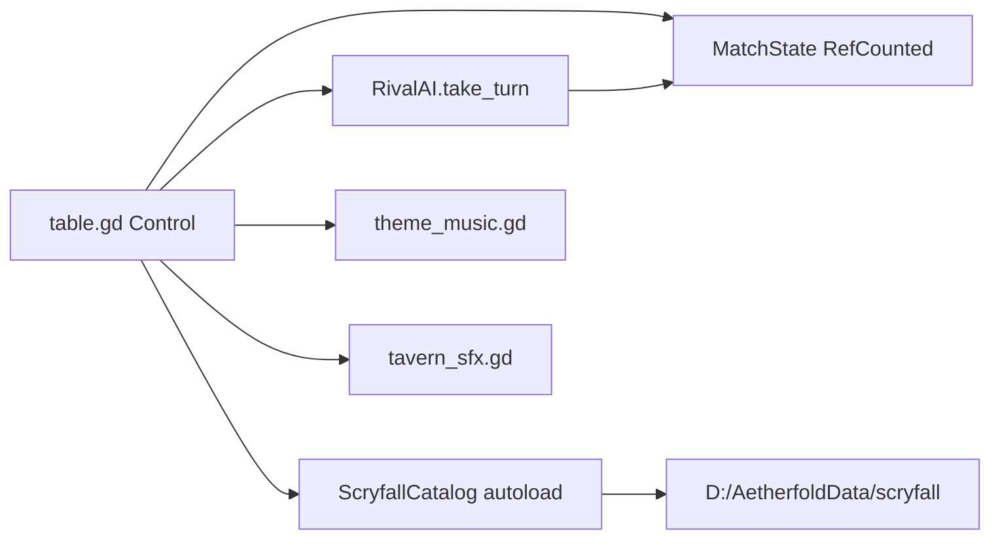
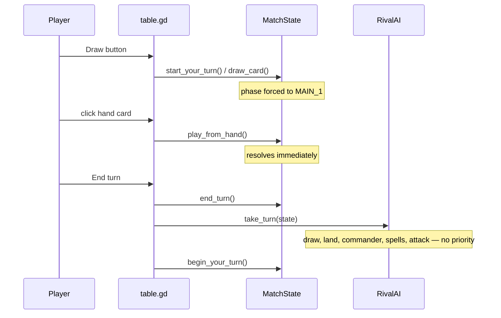
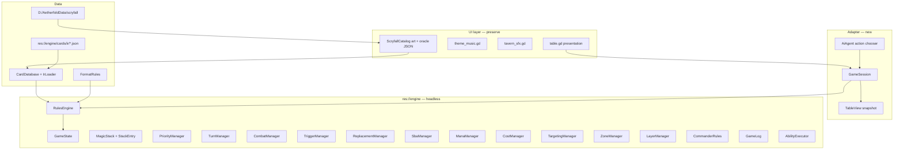
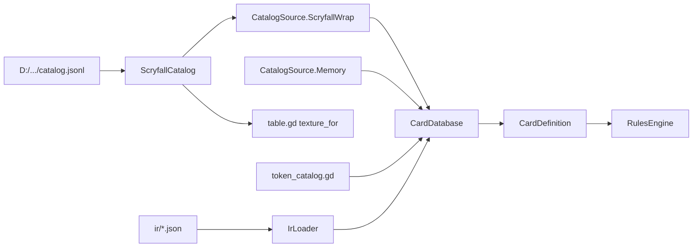

# Aetherfold Rules Engine Design

| Field | Value |
| --- | --- |
| **Title** | Aetherfold Commander-First Rules Engine |
| **Project** | Aetherfold (Godot 4.7) |
| **Author** | Grok (design-doc-writer) |
| **Date** | 2026-09-11 |
| **Status** | Draft (user decisions 2026-09-11 incorporated) |
| **Type** | Architecture / incremental migration |
| **Code freeze** | This document is the deliverable. No game code is changed by this work. |
| **User decisions (2026-09-11)** | (1) End turn auto-passes empty stack after Pass UX; flag-off still Passes phases. (2) 1v1 table first; engine N=4. (3) **Legal singleton Commander demo lists now** (`allow_demo_illegal_decks` default **false**). (4) Cave cycling / Opt scry / Ponder look stubbed in v1. (5) “Attack all legal” button; full picker later. (6) Recursive MCP test discovery in **PR-01**. |

---

## Overview

Aetherfold is a working Godot 4.7 table prototype: a 1v1 Krenko vs Talrand Commander *skin* with Scryfall art, hover zoom, fly-ins, tap rotation, tavern SFX, generated theme music, and a difficulty menu. It is **not** a Magic: The Gathering rules engine. `scripts/match_state.gd` stores two dictionary players (`you` / `rival`), treats graveyard and exile as integer counters, treats mana as “untapped land count,” and resolves spells immediately in `play_from_hand()`. `scripts/rival_ai.gd` takes an atomic full turn and special-cases card names (`opt`, `ponder`, `unsummon`, `counterspell`). There is no stack, no priority, no targeting, no layers, no state-based actions, no player combat, and no tests under `res://tests/`.

This document proposes a **headless, Commander-first rules kernel** under `res://engine/`, consumed by the existing table through a `GameSession` adapter. Cards become data plus an Ability IR. The engine enforces Comprehensive Rules–style procedures (zones, stack, APNAP priority, SBA loop, layers, commander tax/damage) so cards interact through shared primitives rather than pairwise scripts. The current table UI, Scryfall catalog on `D:\AetherfoldData\scryfall`, audio, and Godot project stay.

**v1** is the kernel plus a **legal singleton** Krenko vs Talrand Commander demo running *on* that kernel *and on the existing 1v1 table*, with a short list of real interactions (stack, Counterspell/Cancel, Talrand’s trigger, Dragon Fodder tokens, commander tax, summoning sickness, land drop, mana payment, Krenko `{T}` activate, human pass windows). Prototype `_seed_*` multiplicity (12× Ringleader, 16× Fodder, …) is **not** the shipping demo. v1 is **not** “MTG rules compliant” and must not be described that way. Parser work, leftover demo-card sentences (cycling/scry/Ponder look, Muxus ETB, …), 4-player soak tests, and a comprehensive CR pack are **v1.1 / later**.

---

## Background & Motivation

### Why this change is needed

The prototype already looks like a game. That is the trap. Every new card today is either a no-op (Krenko’s activated ability is printed in `seed_demo()` and never executed) or a name check (`_resolve_you_spell` only handles `"dragon fodder"`; `_on_spell` only handles `"opt"` / `"ponder"` / `"unsummon"`). Counterspell is recognized by `_is_counterspell()` solely so Expert AI *holds* it — it never counters. Adding real Magic interactions on this foundation means an exploding matrix of special cases, and it cannot be tested without the table scene.

A rules engine inverts that: the kernel implements procedures from the Comprehensive Rules (CR). Cards declare abilities in a structured IR (`DRAW`, `CREATE_TOKEN`, `COUNTER_SPELL`, `CREATE_CONTINUOUS_EFFECT`, …). Talrand’s Drake is not “if the AI cast an instant, append a Drake dict”; it is a trigger on `SPELL_CAST` whose effect is `CREATE_TOKEN`. Counterspell is a spell on the stack that targets a spell on the stack.

**Prototype Krenko text is wrong.** `seed_demo()` prints `{4}{R}: Create X 1/1 red Goblin creature tokens…` with `cmc: 5`. Real Oracle (already written into inspector `text` by `table.gd` `_apply_scryfall()` from `oracle_text`) is `{T}: Create X 1/1 red Goblin creature tokens, where X is the number of Goblins you control.` The kernel uses real Oracle. See Key Decision 16.

### Current pain points (from the code, not theory)

- **Immediate resolution.** `MatchState.play_from_hand()` (`scripts/match_state.gd`) moves a creature to `you["creatures"]` or increments `you["graveyard"]` and calls `_resolve_you_spell` in the same function. There is nowhere for a Counterspell to exist.
- **Atomic opponent turn.** `table.gd` `_on_end_turn()` calls `state.end_turn()`, then `RivalAI.take_turn(state)`, then `state.begin_your_turn()` with no player window. Instants cannot be cast in response.
- **Zones are UI piles, not CR zones.** Battlefield is split into `creatures` / `noncreatures` / `lands`. Graveyard and exile are `int` counts (`you["graveyard"] = int(you["graveyard"]) + 1`). Cards that go to GY cannot return.
- **Mana is a land counter.** `mana_available()` counts untapped lands; `tap_player_lands()` taps N of them. No mana pool, no colors, no mana abilities on the stack-or-not distinction, no emptying at step end (CR 106.4).
- **Phase enum is decorative.** `Phase { UNTAP, UPKEEP, DRAW, MAIN_1, COMBAT, MAIN_2, END }` exists, but `next_stage()` only advances the integer. Playing a land or spell does not consult `phase`. Combat is not a phase machine; only the AI deals unblocked face damage in `_attack()`.
- **No object identity.** Cards are Dictionaries with string ids (`"fodder_3"`, `"you_tok_1"`). Moving a card keeps the same dict. CR 400.7 (zone-change creates a new object) is not modeled.
- **Rules text is a string for the inspector.** `oracle_text` is copied from Scryfall in `table.gd` `_apply_scryfall()` and shown in the sidebar. Nothing parses or compiles it.

### What must not happen

A big-bang rewrite of `table.gd` (1062 lines of working presentation) would destroy hover zoom, fly-ins, tap tweens, dice, music, SFX, and the difficulty menu to get a rules kernel. The engine is added *beside* the table; the table becomes a client. Migrating the table is **several PRs** (read-only view, play/draw/end-turn control-flow inversion, stack-response UX). It is not a boolean flag flip.

---

## Current-State Assessment

Answers to the twelve inspection questions. Every claim is cited to a file and function that exists today. There is no `res://engine/`, no `res://tests/`, and no deck-builder scene.

### 1. Current architecture

**Shape:** a single main scene plus six game scripts and a Scryfall autoload.

| Piece | Path | Role |
| --- | --- | --- |
| Project | `C:\Users\Ryan\Documents\aetherfold\project.godot` | Godot 4.7, GL Compatibility, main scene `res://scenes/table.tscn` |
| Main scene | `scenes/table.tscn` | Empty `Control` named `Table` with `scripts/table.gd` |
| Table UI | `scripts/table.gd` | Builds the entire UI in `_build()`; owns `MatchState`, audio, hover, dice, menu |
| Match logic | `scripts/match_state.gd` | `extends RefCounted`; dictionaries `you` / `rival`; demo seeder and play rules |
| Opponent | `scripts/rival_ai.gd` | `extends RefCounted`; static `take_turn(state)` |
| Catalog | `scripts/scryfall_catalog.gd` | Autoload `ScryfallCatalog`; JSONL + image cache on `D:/AetherfoldData/scryfall` |
| Music / SFX | `scripts/theme_music.gd`, `scripts/tavern_sfx.gd` | Procedural `AudioStreamGenerator` players parented by the table |
| Tools | `tools/fetch_scryfall.py`, `tools/fetch_card_images.py` | Lean Oracle catalog and demo-card image fetch |
| MCP | `addons/godot_ai/` | Editor plugin; autoload `_mcp_game_helper`; test runner expects `res://tests/` |

**Autoloads** (`project.godot` `[autoload]`):

- `_mcp_game_helper` = `*res://addons/godot_ai/runtime/game_helper.gd` (debugger screenshots / game eval; not game rules)
- `ScryfallCatalog` = `*res://scripts/scryfall_catalog.gd`

**Runtime flow today:**



There is no rules kernel, no session object, no event log, and no separation between “mutate game” and “draw UI.” `table.gd` calls `state.play_from_hand()`, then `_refresh()` reads `state.you["creatures"]` etc.

### 2. Current card representation

Cards are **untyped Dictionaries**, created by `MatchState._card()`:

```gdscript
# scripts/match_state.gd :: _card
return {
    "id": id,              # instance string, e.g. "fodder_3", "krenko"
    "name": card_name,
    "type": type_line,     # not "type_line"
    "text": text,          # not "oracle_text"
    "color": color,        # Godot Color for UI tint, not WUBRG
    "kind": kind,          # "spell" | "land"
    "cmc": cmc,            # int, used as mana cost
    "sick": false,
    "tapped": false,
}
```

Commanders additionally have `"power"` / `"toughness"` strings. Tokens from `_make_you_token()` / `RivalAI._make_drake()` add those plus a synthetic id.

`table.gd` `_apply_scryfall()` overlays catalog fields onto the same dict: `type_line` → `type`, `oracle_text` → `text`, plus `scryfall_id`, `images`, `cmc`, `power`, `toughness`. The overlay is presentation (art, inspector). It does not add abilities, keywords as rules, color identity, or mana cost symbols.

**Identity is the dictionary’s `"id"` string**, not Scryfall `oracle_id`. Duplicate demo copies (`ringleader_1` … `ringleader_12`) are distinct dicts with the same printed name.

There is no `CardDefinition`, no copiable values, no characteristics vs printed values. Catalog `faces` **are** used for name indexing in `ScryfallCatalog._index_name` (so “front-face” search works); they are unused as rules, layout, or DFC handling.

### 3. Current game-state system

`MatchState` (`scripts/match_state.gd`) is a single `RefCounted` with:

| Field | Meaning |
| --- | --- |
| `turn`, `active_is_you`, `phase` | Clock. Phase is display + `next_stage()` only |
| `you`, `rival` | Two hard-wired player dictionaries |
| `selected_id` | UI selection |
| `difficulty` | 0–3, consumed by `RivalAI` |
| `rival_commander_tax` | Integer; **you have no commander tax field** |
| `you_land_played`, `you_mana_spent`, `rival_mana_spent` | Turn-local flags/counters |
| `you_drew_this_turn` | Starts `true` so the human skips the first draw |
| `you_token_seq` | Token id counter (rival uses `rival["drake_seq"]`) |

Each player dict:

```
name, subtitle, life,
library (int count), graveyard (int), exile (int),
command[], creatures[], noncreatures[], lands[],
hand[], library_cards[]
```

`library` starting at 92 is the leftover after a 7-card opener from a 99-card list (`99 - 7 = 92`), not a separate rules object. `library` and `library_cards.size()` are kept in sync by hand.

**Not modeled:** shared battlefield, stack, priority player, mana pool, poison/commander-damage totals, emblems, effects list, timestamps, game seed / rng stream, event log, more than two players.

`find_card()` linear-searches hand/lands/creatures/noncreatures/command for both players. It does **not** search `library_cards`, so a library card is not findable until drawn.

### 4. Current card-effect system

There isn’t one. Effects are name `match`es:

| Location | Behavior |
| --- | --- |
| `MatchState._resolve_you_spell()` | If `name.to_lower() == "dragon fodder"`, call `_make_you_token` twice. Any other instant/sorcery is a GY increment with empty extra text. |
| `RivalAI._on_spell()` | `opt`/`ponder` → `_draw_one`. `unsummon` at difficulty ≥ 2 → `_bounce_you` (pop last human creature into hand). |
| `RivalAI._play_spell()` | If `_talrand_in_play()` (name contains `"Talrand"`) and the card is instant/sorcery, `_make_drake()`. |
| `RivalAI._is_counterspell()` | Name is `counterspell` / `cancel` / `swan song` — used only to *avoid casting* on Expert when mana leftover would be `< 2`. Never counters. Swan Song is **not** in the demo deck or in `tools/fetch_card_images.py` `NAMES`. |
| `MatchState.activate_selected()` | If the selected card is in hand, `play_from_hand`; if already in play, returns a string telling the player to click a hand card. **Krenko’s activated ability is unreachable.** |

No targeting, no modes, no optional costs, no replacement effects, no continuous effects, no keyword handlers (Flying is a string on Drake tokens; combat does not use it).

### 5. Current turn system



- `end_turn()`: requires `active_is_you`; sets `active_is_you = false`, resets `rival_mana_spent`, untaps rival lands, clears rival `sick`, sets `phase = UNTAP`.
- `RivalAI.take_turn()`: `_draw`, `_play_land`, `_cast_commander`, `_cast_spells`, `_attack`. One function, no steps.
- `begin_your_turn()`: `turn += 1`, reset land/mana/draw flags, untap *lands only* (not creatures), clear sick, `phase = DRAW` (skips presenting UNTAP/UPKEEP).
- `draw_card()`: one card if `not you_drew_this_turn`, then `phase = MAIN_1`.
- `next_stage()`: `(phase + 1) % 7`. No phase actions. Player can click “Next stage” into Combat without declaring attackers.

Turn 1 skip-draw is accidental 1v1 correctness: `you_drew_this_turn = true` in `seed_demo()`. Four-player Commander must *not* skip that draw; this is a `FormatRules` flag, not a hard-coded bool.

### 6. Current multiplayer implementation

**None.** Exactly two dictionary players, UI labels “You” / “Rival”, one human seat, one scripted Talrand. No player list, no APNAP, no range of influence, no turn order beyond `active_is_you` toggling. 4-player Commander is not sketched.

### 7. Current database

`ScryfallCatalog` (`scripts/scryfall_catalog.gd`):

- Data dir: `D:/AetherfoldData/scryfall`, overridable by `AETHERFOLD_SCRYFALL_DIR`.
- Loads `catalog.jsonl` + `meta.json`. Indexes `cards_by_id` and `cards_by_name` (normalized lower-case, with a `_name_score` that prefers exact name, basic land, `commander_legal`, `layout == normal`). Face names from `faces` are indexed as additional lookup keys.
- `texture_for(card, kind)` loads `{scryfall_id}_{small|normal}.jpg` from `images/`, with HTTP fallback via `HTTPRequest`.
- Signal `art_updated(card_id)` → `table.gd` `_on_art_updated` → `_refresh()`.

`tools/fetch_scryfall.py` `lean_card()` fields: `id`, `oracle_id`, `name`, `mana_cost`, `cmc`, `type_line`, `oracle_text`, `colors`, `color_identity`, `keywords`, `power`, `toughness`, `loyalty`, `layout`, `set`, `set_name`, `collector_number`, `rarity`, `commander_legal`, `faces`, `images`.

**The catalog is a card-database and art layer. It is not a rules engine.** Oracle text is a string. Keywords are a JSON array of English words. Nothing in the catalog is executed.

Constraint (preserved): **do not pack bulk JSON or all images into `res://`.** Keep the D: (or env) split.

### 8. Current UI

`scripts/table.gd` (~1062 lines) constructs every control in code from `_build()`:

- Header: turn/phase label, Next stage, End turn, Mute, SFX, Dice, Menu
- Two fields (`_make_field`): rival Lands / Non-creature / Creatures; you Creatures / Non-creature / Lands
- Hand row; sidebar life, pile table (Library / GY / Exile / Command counts), inspector (art + type + text), “Play selected”, 5-line status `log_label`
- Turn border (green/red), pulsing Draw button, deck pile button
- Hover zoom (`_on_hover_card` tween scale/alpha)
- Fly-ins (`_fly_card` TextureRect tween)
- Tap rotate (`_apply_tap_visual` 90°)
- Difficulty overlay (`RivalAI.label` + `DIFFICULTY_HINTS`)
- Dice overlay (d4–d20)
- Theme music + tavern SFX children (`table._ready` parents `ThemeMusic` and `TavernSfx`)

The table **mutates rules state directly** (`state.play_from_hand`, `state.end_turn`, `RivalAI.take_turn`). `_refresh()` is a full rebuild of zone chips (`_clear` + `_card_chip`). Fly-ins and SFX key off **return-string prefixes** (`msg.begins_with("Played")`, `msg.begins_with("Cast")`, `msg.find("token")`, `msg.begins_with("Drew")`).

**Preserve:** presentation systems (hover, fly-in, tap, dice, SFX, music, menu, inspector, Scryfall art). **Change:** the mutation API and the end-turn control flow, via an adapter, not a rewrite of `_build()`. That change is a **control-flow inversion**, specified call-site by call-site below — not a small flag.

### 9. Current deck builder

**Does not exist.** No scene, no script, no collection UI. Decks today are `_seed_krenko()` and `_seed_talrand()`: hardcoded arrays with **singleton violations** (12 Goblin Ringleader, 16 Dragon Fodder, 16 Opt, 12 Counterspell, 9 Cancel, …). Opening hands are fixed index slices, remainder shuffled.

That prototype multiplicity is **current-state only**. The engine shipping demo (user decision 2026-09-11) **rebuilds legal singleton Commander lists** (99+1, basics may repeat, color identity of Krenko/Talrand, `commander_legal`). See `DemoSetup` and PR-14. Opening-hand *policy* remains a **fixed 7-card slice of the new legal lists** for test determinism — not a copy of the illegal `_seed_*` indices.

v1 does not need a deck builder. The engine needs a `DeckList` resource so the seeder can be replaced without the table inventing cards.

### 10. Current Commander support

Cosmetic / partial:

| Rule | Today |
| --- | --- |
| 40 life | Yes (`you["life"] = 40`) |
| Command zone | `command[]` arrays; UI shows a short name in the pile table |
| Commander tax | `rival_commander_tax` only; incremented by +2 in `RivalAI._cast_commander()`. Human commander is never cast from the command zone (no UI, no function). |
| Commander damage | Not tracked. AI combat is generic life loss. |
| Color identity | Catalog has `color_identity`; unused for deck rules |
| Singleton / 99+1 | Demo decks are 99 + commander but illegal (many copies) |
| CZ replacement (die → command zone) | Impossible: GY is an int, commanders are never moved to GY |
| Partner / background / sit-anywhere | Absent |

Format is “1v1 table that says Commander,” not Commander.

### 11. Current rules limitations

Honest list of what the prototype cannot do, relative to a real kernel:

1. No stack, no LIFO resolve, no “counter target spell.”
2. No priority, no APNAP, no instants on the opponent’s turn.
3. No targeting (Unsummon is “bounce the last creature in the array”).
4. No SBA loop (0 life is checked only in `_on_end_turn` after the AI; 0 toughness, legend rule, commander damage 21 — absent).
5. No layers / continuous effects; P/T is a string on the dict.
6. No combat phase: no attack declaration for the player; AI damage ignores blockers, flying, summoning sickness on the *player* side of combat (player cannot attack at all).
7. Untap step untaps lands only (`_untap_lands`), not creatures or other permanents.
8. Mana = untapped land count; colored costs are not paid (demo is mono-red vs mono-blue so this is hidden).
9. Lands do not have mana abilities; tapping is done by the cost function.
10. Instant vs sorcery timing is not checked (player can “cast” a sorcery whenever `active_is_you`).
11. Tokens are not CR tokens (no `token` flag, no “leave play → cease to exist”).
12. Library empty does not lose (just `"Your library is empty."`).
13. No game log (one status string, overwritten).
14. No tests (`res://tests/` is missing; `test_handler.gd` `_discover_suites()` would return “directory may not exist”).

### 12. Existing technical debt

- **God object UI.** `table.gd` is scene, controller, animation, audio host, and rules caller.
- **Untyped dictionaries** as the schema. Typos in keys fail at runtime; there is no `class_name`.
- **GY/exile counts** throw away objects; any “return from GY” card is a data-model break.
- **Name-based rules** (`to_lower()` on `"dragon fodder"`) will fight Ability IR if left in place.
- **Asymmetric commander tax** (`rival_commander_tax` only).
- **Battlefield split** (`creatures`/`noncreatures`/`lands`) encodes a UI layout into state. Auras, vehicles, land-creatures, and “noncreature spells” on the stack cannot be represented cleanly.
- **AI mutates state** instead of issuing legal actions — cannot share a rules path with the player.
- **Demo legality (current code).** `_seed_*` singleton violations. **Engine demo does not inherit this** — `FormatRules.allow_demo_illegal_decks` defaults **false**; PR-14 builds legal 99+1 lists. A test may still feed an illegal list to prove rejection.
- **Test discovery is top-level only (current addon).** `addons/godot_ai/handlers/test_handler.gd` `_discover_suites()` lists `res://tests/test_*.gd` and does **not** recurse. **PR-01 patches this** so `res://tests/engine/test_*.gd` is discovered.
- **MCP autoload in shipped game.** `_mcp_game_helper` is a project autoload; fine for development, not a rules dependency. Engine tests must not require it.
- **Color as `Color`.** UI tint mixed into card dicts. Rules colors are `PackedStringArray` of `W/U/B/R/G`.
- **House-rule Krenko cost.** Seeded `{4}{R}` disagrees with Scryfall overlay `{T}`.

---

## Goals & Non-Goals

### Goals (v1)

1. Headless rules kernel in GDScript (`RefCounted` / `Resource`, **no Node subclass**, no `table.tscn` requirement). Tests still run in the editor process (a SceneTree exists); they must not require being in the tree, the catalog autoload, or D:.
2. Commander as the engine’s default format via `FormatRules` (4 players, 40 life, 21 commander damage, tax, command zone). 1v1 is a **config** of the same format so the current table keeps working.
3. Real procedures: zones as card lists, GameObject identity + zone-change-creates-new-object (CR 400.7), stack LIFO, APNAP priority, SBA loop before giving priority, mana pool + costs, land drop, summoning sickness.
4. Explicit `EngineMode` state machine. `submit()` is non-blocking: one action, then advance until the next decision.
5. Ability IR + composable effect primitives, stored as JSON and loaded into Resources. Demo cards ship as authored IR. **Never** `if card A meets card B`.
6. A **legal singleton** Krenko vs Talrand demo runs *on* the kernel **and** on the existing 1v1 table (see v1 success bar). Unique filler cards may be vanilla (no IR) until coverage exists.
7. `GameSession` / `TableView` adapter so `table.gd` presentation is preserved. **Do not rewrite `table.gd` in PR-01.** Table migration is multiple PRs.
8. Scryfall catalog remains the card-database/art layer on `D:\AetherfoldData\scryfall` (or `AETHERFOLD_SCRYFALL_DIR`).
9. Automated tests under the MCP runner for every kernel invariant we claim. Tests pump `submit()`; they never `await` a tick.

### Non-goals (explicit)

| Non-goal | Why |
| --- | --- |
| Claiming “MTG rules compliant” or “Arena clone” | False until systems exist and are tested. v1 is a kernel + demo coverage. |
| Full CR + ~30k cards | Multi-year. Out of scope. |
| Full English Oracle parser in v1 | **v1.1 / later.** IR is authored first. |
| Remaining demo-card sentences (Muxus ETB, Ringleader, Snoop, Pashalik, Cave cycling, Opt scry UI, Ponder reorder) | **v1.1.** v1 lists each as implemented / stubbed / vanilla. |
| 4-player soak tests / 4-seat UI | Engine accepts N=4 in v1 construction tests; soak + UI are later. |
| “Comprehensive CR regression pack” | **v1.1.** v1 tests the primitives we claim. |
| Networking / rollback netcode | Engine is action-deterministic so it *can* come later. Not v1. |
| Deck builder, collection, account, economy | Not present; not required for the kernel. |
| Copying MTG Arena assets, shaders, or code | Legal constraint. Original UI/audio only; Scryfall oracle + art URLs. |
| Throwing away `table.gd`, catalog, audio, or the Godot project | Hard constraint. |
| Packing `catalog.jsonl` or all card images into `res://` | Hard constraint. |
| Implementing every keyword | v1: flying (evasion), token, tap-for-mana. Others no-op until a primitive exists. |
| Standard / Alchemy / Historic as first-class | Commander-first. |
| Exact Arena UX | Functionality target is rules-correct play, not a visual clone. |
| Swan Song | Named in `RivalAI._is_counterspell` only; not a v1 card. |

### v1 success bar (testable)

The following must pass as automated tests **and** be playable on the existing table via `GameSession` (with `auto_yield_empty_stack` **off** for items 6 and 9):

1. Play a land; second land in the same turn is illegal.
2. Tap Mountains for `{R}`; pay `{1}{R}` for Dragon Fodder (mana pool, not land-count). Table may `auto_pay`; tests use explicit `ACTIVATE_MANA_ABILITY`.
3. Dragon Fodder goes on the stack; on resolve, two Goblin tokens are created via `CREATE_TOKEN` (not a name special-case).
4. Goblin tokens have summoning sickness; `can_attack` is false the turn they enter.
5. Cast Opt; it uses the stack; Talrand’s trigger waits, then goes on the stack, then creates a Drake. Opt v1 effect is `DRAW` 1; scry is stubbed/`unparsed`.
6. Cast a spell; opponent’s Counterspell (or Cancel) targets it; spell is countered and goes to GY as a **card object**, not `graveyard += 1`.
7. Cast Talrand from the command zone for `{1}{U}{U}`; recast costs two extra generic; tax is tracked per commander **for both players**.
8. The **human** can `CAST_SPELL` Krenko from the command zone (table: command pile chip and/or inspector + Play selected). Then Krenko’s **`{T}`** activated ability (real Oracle) can be activated from the battlefield. Tap cost; summoning sickness applies (CR 302.6). X = number of Goblins you control via a `Query`, not a magic string. Inspector `text` is the same Oracle sentence the IR implements. CZ cast is a prerequisite of `{T}` — do not ship activate-only.
9. Human player can pass priority on a non-empty stack; AI does not take an atomic five-step turn without windows. A human can Pass and the AI can CAST Counterspell.

Until those tests exist and pass, **do not** describe Aetherfold as rules-compliant.

**v1.1 / later** (not the success bar): subset Oracle parser, remaining demo-card IR, 4-player soak, comprehensive CR pack, 4-seat UI, scry/cycling/Ponder choice UX.

---

## Gap Analysis vs CR / Arena-like play

| CR / Arena subsystem | Aetherfold today | v1 kernel | Later |
| --- | --- | --- | --- |
| Players, life, seats | 2 dicts | N players, `FormatRules.player_count` | 4-seat UI |
| Zones (CR 400) | UI piles + GY int | Real zones, object lists | Hidden zones UX |
| Zone-change identity (400.7) | Same dict | New `GameObject` + links | — |
| Stack (405) | None | Spell `GameObject` in stack zone + `StackEntry` wrappers | Copyable spells, split cards |
| Priority (117) | Active player acts freely | APNAP, hold priority, `EngineMode` | Full shortcuts / yield |
| Timing (sorcery vs instant) | Unchecked | Phase/step + stack empty | Special timing (flash, ninjutsu) |
| Mana pool (106) | Land count | Colored pool, empty at step end | Mana of any color, snow, etc. |
| Costs (118) | `cmc` int | Mana + tap + tax additional cost; `PAYING_COSTS` mode | Hybrid, additional/alt costs |
| Targeting (115) | None / pop_back | Legal targets at cast and resolve | Complex restrictions |
| Triggers (603) | Name checks | Event → waiting triggers → stack | Intervening-if, linked |
| SBA (704) | Life ≤ 0 after AI turn | Loop until stable; **yields** on legend choice | Niche SBAs |
| Layers (613) | Mutate dict P/T | Pipeline + synthetic pump test | Unusual copiable layers |
| Combat (506–510) | AI face damage | Attackers, sickness, unblocked damage; blockers optional | Banding, split strike, etc. |
| Commander (903) | 40 life, rival tax | Tax both, CZ replacement, 21 damage | Partners, extra commanders |
| Keywords | Strings | Flying / token / mana abilities | Full keyword corpus |
| Oracle parser | None | IR authored | Subset English compiler |
| Game log | 5-line label | Structured event log | Replay / export |
| Tests | None | Kernel + demo suites | Golden CR cases |
| Multiplayer | 1v1 only | Engine N=2..4 construction | 4p soak, networking |
| AI | Atomic script | Legal-action chooser | Search / stronger policy |
| RNG | `randomize()` | `GameState.rng` seeded | — |

**Arena-like functionality** in this project means: the engine makes the same *legal* plays available (cast, respond, counter, trigger, combat, commander rules), not that we reproduce Arena’s client, animations, or card coverage.

---

## Proposed Design

### Core principles

1. **UI never mutates zones.** `table.gd` submits a `GameAction`. The engine validates, applies, emits events. The table renders a `TableView` and animates events.
2. **`submit()` never blocks.** It applies one action, runs `_advance_until_decision()`, and returns `SubmitResult`. Tests pump `submit()` in a `while` loop. There is no `await tick()`.
3. **`EngineMode` is explicit.** Cast/activate/pay is a nested CR 601.2 / 602.1 machine, not one atomic “validate + apply” box. Mana abilities are legal in `PAYING_COSTS`.
4. **GameObject identity.** An object in a zone has `object_id`. A zone change retires that id and creates a new object with a new timestamp (CR 400.7). `linked_from` is lineage only.
5. **Event log is the debug source of truth.** Every legal mutation appends a `GameEvent`.
6. **Effects are primitives.** Cards do not call each other.
7. **Characteristics are computed.** Printed P/T is copiable; until-EOT +1/+1 is a layer-7c effect.
8. **Priority is APNAP, and only in steps that receive priority.** Untap never gives priority (CR 502.4). Cleanup usually does not (CR 514.3).
9. **FormatRules is data.** 4-player Commander is default; 1v1 is `player_count = 2`.
10. **Headless types.** No engine type subclasses `Node`. Tests do not require `table.tscn`, being in the tree, the catalog autoload, or D:.

### High-level architecture



### Module layout (file paths)

```
res://engine/
  engine.gd                      # class_name RulesEngine
  format_rules.gd                # class_name FormatRules (Resource)
  game_state.gd                  # class_name GameState
  game_object.gd                 # class_name GameObject
  player_state.gd                # class_name PlayerState
  game_action.gd                 # class_name GameAction
  game_event.gd                  # class_name GameEvent
  game_log.gd                    # class_name GameLog
  game_view.gd                   # class_name GameView (engine snapshot)
  submit_result.gd               # class_name SubmitResult
  rng_stream.gd                  # class_name RngStream
  ids.gd                         # int ids; 0 = none
  enums.gd                       # ZoneId, Phase, Step, EngineMode, EventType, ...

  zones/zone.gd, zone_manager.gd
  stack/stack.gd, stack_entry.gd
  priority/priority_manager.gd
  turn/turn_manager.gd
  combat/combat_manager.gd, combat_state.gd
  triggers/trigger_manager.gd, trigger_spec.gd
  replacement/replacement_manager.gd, replacement_spec.gd
  sba/sba_manager.gd
  mana/mana_pool.gd, mana_cost.gd, mana_manager.gd
  costs/cost.gd, cost_manager.gd, restriction.gd
  targeting/targeting_manager.gd, target_query.gd, query.gd
  layers/layer_manager.gd, continuous_effect.gd, characteristics.gd
  commander/commander_rules.gd

  cards/
    card_definition.gd
    card_database.gd
    catalog_source.gd            # class_name CatalogSource
    token_catalog.gd
    deck_list.gd                 # class_name DeckList
    ir_loader.gd                 # JSON → Array[Ability]
    ir_schema.md                 # human schema for authors (this design is the spec until the file exists)
    ir/
      krenko_mob_boss.json
      talrand_sky_summoner.json
      dragon_fodder.json
      counterspell.json
      cancel.json
      opt.json
      unsummon.json
      forgotten_cave.json
      mountain.json              # optional; basics may be inferred
      island.json
    keywords/keyword_table.gd    # v1.1 expansion; v1 flying/token in table or IR flags

  abilities/
    ability.gd
    effect.gd
    ability_executor.gd
    parser/oracle_parser.gd      # v1.1; not required for demo

  ai/ai_agent.gd, talrand_policy.gd

  session/
    game_session.gd
    table_view.gd                # MatchState-shaped façade
    demo_setup.gd

res://tests/
  engine/                        # PR-01 recursive discovery: test_*.gd here ARE suites
    fixtures.gd                  # helpers, name does not begin with test_
    test_engine_state.gd
    test_engine_zones.gd
    test_engine_mana.gd
    test_engine_land.gd
    test_engine_turn.gd
    test_engine_stack.gd
    test_engine_priority.gd
    test_engine_ir.gd
    test_engine_targets.gd
    test_engine_triggers.gd
    test_engine_sba.gd
    test_engine_layers.gd
    test_engine_combat.gd
    test_engine_commander.gd
    test_engine_krenko.gd
    test_engine_demo.gd
    test_engine_deck_legal.gd
    test_engine_no_nodes.gd
    test_engine_legal_actions.gd
```

`scripts/match_state.gd` remains until the table default flips and the old path is deleted. `scripts/rival_ai.gd` keeps `label(difficulty)` through v1.

---

### EngineMode and the non-blocking game loop

This is the difference between the prototype and a rules engine. There is **one** machine. `CAST_SPELL` is not an atomic “validate + apply + resolve” box.

```gdscript
# enums.gd
enum EngineMode {
    GIVING_PRIORITY,
    CASTING,                 # CR 601.2 in progress
    ACTIVATING,              # CR 602.1 in progress (non-mana)
    PAYING_COSTS,            # nested under CASTING or ACTIVATING
    DECLARING_ATTACKERS,
    DECLARING_BLOCKERS,
    ASSIGNING_COMBAT_DAMAGE,
    CHOOSING_SBA,
    CHOOSING_REPLACEMENT,
    GAME_OVER,
}
```



```mermaid
stateDiagram-v2
  [*] --> Advance
  Advance --> GIVING_PRIORITY: step receives priority
  Advance --> Advance: untap TBAs only / cleanup nothing waiting
  GIVING_PRIORITY --> CASTING: CAST_SPELL
  GIVING_PRIORITY --> ACTIVATING: ACTIVATE_ABILITY
  GIVING_PRIORITY --> PAYING_COSTS: ACTIVATE_MANA_ABILITY\n(floating mana)
  GIVING_PRIORITY --> DECLARING_ATTACKERS: declare-attackers step
  GIVING_PRIORITY --> GAME_OVER: SBA ends game
  CASTING --> PAYING_COSTS: targets/modes done
  ACTIVATING --> PAYING_COSTS: targets done
  PAYING_COSTS --> PAYING_COSTS: ACTIVATE_MANA_ABILITY
  PAYING_COSTS --> GIVING_PRIORITY: costs paid;\nspell/ability on stack;\ncaster keeps priority
  GIVING_PRIORITY --> Advance: all passed, resolve or next step
  Advance --> CHOOSING_SBA: legend / SBA choice
  CHOOSING_SBA --> Advance: CHOOSE_SBA
  Advance --> CHOOSING_REPLACEMENT: CZ vs other
  CHOOSING_REPLACEMENT --> Advance: CHOOSE_REPLACEMENT
```

**`submit(action) -> SubmitResult` (never blocks):**

1. Reject if `action.player_id` is not the player who must act (`awaiting.player_id`).
2. Reject if `action.kind` is not legal in `state.mode` (table below).
3. Apply that **one** action (propose spell, choose targets, tap a land for mana, pay, pass, …).
4. Call `_advance_until_decision()`:
   - Finish the current 601.2/602.1 step if it needs no further input.
   - If a spell/ability was just put on the stack, emit `SPELL_CAST` / `ABILITY_ACTIVATED`, then SBA/triggers.
   - If all players passed: resolve top of stack **or** advance the step.
   - Beginning of a new step: run **turn-based actions** (see TBA table), empty mana pool at **end** of the previous step (CR 106.4).
   - SBA loop: apply choiceless SBAs until stable; if a choice is required, set `mode = CHOOSING_SBA` and return.
   - Move waiting triggers to stack APNAP; if that creates work, loop SBA/triggers.
   - If the step does **not** receive priority, advance again (untap; most cleanup).
   - Otherwise `mode = GIVING_PRIORITY` (or combat declare mode).
5. Return `{ok, error, events, mode, awaiting}` immediately.

Tests:

```gdscript
func _pump_until(engine: RulesEngine, pred: Callable, max_steps := 64) -> void:
    var n := 0
    while not pred.call() and n < max_steps:
        var acts := engine.legal_actions(engine.state.awaiting.get("player_id", 0))
        # tests pick an explicit action; never await
        engine.submit(acts[0])
        n += 1
```

#### Which actions are legal in which mode

| Mode | Legal `GameAction.Kind` |
| --- | --- |
| `GIVING_PRIORITY` | `PASS_PRIORITY`, `PLAY_LAND` (if timing), `CAST_SPELL` (hand/CZ, timing), `ACTIVATE_ABILITY`, `ACTIVATE_MANA_ABILITY`, `CONCEDE`. Combat declare kinds only in the matching step (those steps use the declare modes below once the active player has started a declaration, or `GIVING_PRIORITY` with `DECLARE_*` as the step action). |
| `CASTING` | `CHOOSE_TARGETS` (and later: modes). No `PASS_PRIORITY`. |
| `ACTIVATING` | `CHOOSE_TARGETS`. No pass. |
| `PAYING_COSTS` | `ACTIVATE_MANA_ABILITY`, `PAY_MANA` (apply floating pool to remaining cost), `CONFIRM_PAY` (when remaining is `{0}`), optional `CANCEL_CAST` (restore). **Mana abilities are legal here** (CR 605.3). No `PASS_PRIORITY`, no casting another non-mana spell. |
| `DECLARING_ATTACKERS` | `DECLARE_ATTACKERS` (set of creature ids, possibly empty). |
| `DECLARING_BLOCKERS` | `DECLARE_BLOCKERS`. |
| `ASSIGNING_COMBAT_DAMAGE` | `ASSIGN_COMBAT_DAMAGE` (v1: skip if one blocker / unblocked). |
| `CHOOSING_SBA` | `CHOOSE_SBA` (e.g. legend: keep this `object_id`). |
| `CHOOSING_REPLACEMENT` | `CHOOSE_REPLACEMENT` (e.g. commander to CZ vs GY). |
| `GAME_OVER` | none (or `CONCEDE` no-op) |

**Casting procedure (CR 601.2), as engine steps — not one tick:**

1. `CAST_SPELL` in `GIVING_PRIORITY` → `mode = CASTING`. Propose: card is not yet moved. Record source `object_id`.
2. Modes: v1 demo cards have none; skip.
3. Targets: if `ability.targets` is non-empty, `awaiting = {type: TARGETS, queries}`; player submits `CHOOSE_TARGETS`.
4. Compute total cost (mana + commander tax additional cost + `{T}` if any). `mode = PAYING_COSTS`. Remaining `ManaCost` on `state.awaiting.cost`.
5. Player activates mana abilities (each `ACTIVATE_MANA_ABILITY` resolves immediately, adds to pool) and/or `PAY_MANA` / table `auto_pay`.
6. When remaining is zero: move card **hand/CZ → stack zone** (new `GameObject`, 400.7), wrap in `StackEntry`, emit `SPELL_CAST`, caster **keeps priority** (`GIVING_PRIORITY` for that player; other players have not passed).

Activating a non-mana ability is the same skeleton (CR 602.1) with `ACTIVATING` instead of `CASTING`. Mana abilities skip the stack entirely (CR 605): `ACTIVATE_MANA_ABILITY` in `GIVING_PRIORITY` or `PAYING_COSTS` taps/pays, `ADD_MANA` to pool, player still in the same mode.

#### Turn-based actions (TBA) — not priority

`_advance_until_decision` runs TBAs at step boundaries. Players do **not** get priority in order to “click draw” or “click untap.”

| Step | Start TBA | Receives priority? | End TBA |
| --- | --- | --- | --- |
| Untap | Untap all permanents the active player controls; clear `summoned_this_turn` at **start of turn** (CR 302.6 — actually sickness ends as turn begins; implement “does not have summoning sickness if it started the turn under your control”). | **No** (CR 502.4). Advance immediately. | — |
| Upkeep | none in v1 | Yes | Empty mana pool |
| Draw | **Engine draws one card** for the active player, unless `turn_number == 1` and `FormatRules.first_player_skips_draw`. Empty library → SBA loss. | Yes, after the draw | Empty mana pool |
| Main (pre/post) | none | Yes | Empty mana pool |
| Begin combat | none | Yes | Empty mana pool |
| Declare attackers | Active player must `DECLARE_ATTACKERS` (may be empty) | After attackers declared, APNAP | Empty mana pool |
| Declare blockers | NAP `DECLARE_BLOCKERS` (v1 1v1: may be empty) | After | Empty mana pool |
| Combat damage | Assign/deal combat damage as TBA (v1 unblocked → face; commander damage recorded) | Yes after damage | Empty mana pool |
| End combat | none | Yes | Empty mana pool |
| End | none | Yes | Empty mana pool |
| Cleanup | Discard to max hand (v1: skip unless > 7 and we care); remove until-EOT effects; SBA; delayed triggers. If anything is waiting or a player would get priority, loop (CR 514.3). **Usually no priority.** | Only if needed, then loop cleanup | Empty pool if a priority window happened |

**Draw button is UI-only.** The engine draw TBA already happened. `_waiting_for_draw()` must not gate legality after the table is on the kernel. The flashing Draw button may play the fly-in for the `DRAW` event; it must not be the thing that creates the card.

---

### Type sketches

#### ids

Runtime identity is `int`, `0` = none. `object_id`, `player_id`, `stack_entry_id`, `effect_id` are ints allocated from `GameState.next_*`. Ability identity on a definition is `StringName` (`&"krenko_tap"`). Scryfall `oracle_id` / print `id` are `String`.

#### GameState

```gdscript
class_name GameState
extends RefCounted

var rules: FormatRules
var players: Array[PlayerState]     # index == player_id
var objects: Dictionary             # int object_id -> GameObject
var next_object_id: int = 1
var next_stack_id: int = 1
var next_timestamp: int = 1
var turn_number: int = 1
var active_player_id: int = 0
var priority_player_id: int = 0
var passed_since_action: Array[int] # player ids who passed in succession
var phase: int                      # enums.Phase
var step: int                       # enums.Step
var land_played: Dictionary         # player_id -> bool this turn
var stack: MagicStack
var zones: ZoneManager
var combat: CombatState
var effects: Array                  # ContinuousEffect
var waiting_triggers: Array
var mode: int                       # EngineMode
var awaiting: Dictionary            # {player_id, type, ...}
var rng: RngStream
var rng_seed: int
var ended: bool = false
var winners: Array[int] = []
var log: GameLog
```

#### PlayerState

```gdscript
class_name PlayerState
extends RefCounted

var player_id: int
var name: String
var life: int
var mana: ManaPool
var commander_ids: Array[int]          # current CZ/battlefield object ids (lineage via linked_from)
var commander_cast_count: Dictionary   # commander_lineage_key -> int
var commander_damage_from: Dictionary  # lineage_key -> int
var lost: bool = false
```

#### RngStream

```gdscript
class_name RngStream
extends RefCounted

var rng := RandomNumberGenerator.new()

func setup(seed: int) -> void:
    rng.seed = seed

func shuffle(arr: Array) -> void:
    for i in range(arr.size() - 1, 0, -1):
        var j := rng.randi_range(0, i)
        var tmp = arr[i]
        arr[i] = arr[j]
        arr[j] = tmp

func randf() -> float:
    return rng.randf()
```

`DemoSetup` takes `seed: int` (tests use `1`). Opening hands are a **fixed 7-card slice of the legal singleton lists** (not a shuffled 7, and not the prototype illegal indices). `state.rng` shuffles only the leftover library. `TalrandPolicy` uses `state.rng`, never `RandomNumberGenerator.randomize()`. Table dice stay local UI rng (not game state).

#### SubmitResult (single type for Engine and Session)

```gdscript
class_name SubmitResult
extends RefCounted

var ok: bool = true
var error: String = ""
var events: Array = []          # Array[GameEvent]
var mode: int = 0               # EngineMode
var awaiting: Dictionary = {}   # {player_id: int, type: StringName, ...}

func to_dict() -> Dictionary:
    return {ok = ok, error = error, events = events, mode = mode, awaiting = awaiting}
```

`RulesEngine.submit` and `GameSession.submit` both return `SubmitResult`.

#### ManaCost

```gdscript
class_name ManaCost
extends Resource

var generic: int = 0
var w: int = 0
var u: int = 0
var b: int = 0
var r: int = 0
var g: int = 0
var colorless: int = 0

static func parse(s: String) -> ManaCost:
    # "{4}{R}" → generic=4, r=1; "{T}" is a Cost tap, not mana
    # "{1}{U}{U}" → generic=1, u=2
    var c := ManaCost.new()
    var re := RegEx.create_from_string("\\{([^}]+)\\}")
    for m in re.search_all(s):
        var tok := m.get_string(1)
        if tok.is_valid_int():
            c.generic += int(tok)
        else:
            match tok:
                "W": c.w += 1
                "U": c.u += 1
                "B": c.b += 1
                "R": c.r += 1
                "G": c.g += 1
                "C": c.colorless += 1
                _: pass  # hybrid later
    return c

func cmc() -> int:
    return generic + w + u + b + r + g + colorless
```

v1 does not parse hybrid/phyrexian. Unparsed symbols fail `parse` tests until implemented.

#### DeckList / CatalogSource

```gdscript
class_name DeckList
extends Resource

@export var commander_oracle_ids: PackedStringArray
@export var library: Array[Dictionary]  # {oracle_id?: String, name: String, count: int}
```

```gdscript
class_name CatalogSource
extends RefCounted

func find_by_name(_n: String) -> Dictionary:
    return {}
func find_by_id(_id: String) -> Dictionary:
    return {}

class Memory extends CatalogSource:
    var by_name: Dictionary = {}
    var by_id: Dictionary = {}
    func find_by_name(n: String) -> Dictionary:
        return by_name.get(n.strip_edges().to_lower(), {})
    func find_by_id(id: String) -> Dictionary:
        return by_id.get(id, {})

class ScryfallWrap extends CatalogSource:
    # production: call autoload if present; engine must not crash if null
    pass
```

#### DemoSetup (legal singleton lists; fixed opener *policy*)

**List rules** (PR-14 tests must assert these; `allow_demo_illegal_decks` default **false**):

| Rule | Krenko seat | Talrand seat |
| --- | --- | --- |
| Size | 100 cards including commander (99 library + 1 CZ) | same |
| Singleton | At most one copy of any non-basic | same |
| Basics | Mountains may repeat | Islands may repeat |
| Color identity | ⊆ `{R}` (Krenko, Mob Boss) | ⊆ `{U}` (Talrand, Sky Summoner) |
| Legality | each card `commander_legal` (basics included) | same |
| Commander | exactly Krenko in CZ | exactly Talrand in CZ |

Do **not** copy `_seed_krenko` / `_seed_talrand` multiplicity. Do **not** invent a full 99-name list in this document. Implementers author two `DeckList` resources that satisfy the table. **Vanilla unique cards** (no IR, do nothing on resolve except exist as permanents/spells that fizzle to GY) fill the rest. That increases authored-IR / vanilla-card count vs the prototype; it is required.

**Must-include named cards** (IR or stub as already specified) so the v1 success bar is playable: Dragon Fodder, Mountain, Forgotten Cave, Opt, Ponder, Unsummon, Counterspell, Cancel, plus the two commanders. Other prototype names (Muxus, Ringleader, Snoop, Pashalik) may appear **once** each if CI-legal.

**Opening-hand policy:** a fixed 7-card slice of *these legal lists* for test determinism, leftover shuffled with `state.rng`. Example (names, not prototype indices):

```gdscript
class_name DemoSetup
extends RefCounted

# Fixed slice of the *legal* lists — not match_state.gd opener indices.
const KRENKO_OPENER_NAMES: PackedStringArray = [
    "Muxus, Goblin Grandee", "Goblin Ringleader", "Dragon Fodder",
    "Conspicuous Snoop", "Forgotten Cave", "Pashalik Mons", "Mountain",
]
const TALRAND_OPENER_NAMES: PackedStringArray = [
    "Island", "Island", "Island", "Opt", "Ponder", "Unsummon", "Counterspell",
]

static func krenko_vs_talrand(db: CardDatabase) -> DemoSetup:
    # Build legal 99+1 DeckLists (CI, singleton except basics, commander_legal).
    # Hand = the seven OPENER_NAMES (order preserved; each must exist once in the list,
    # except basic lands which may be pulled from the basic pool).
    # Library = the rest, shuffled with GameState.rng (seed 1 in tests).
    return DemoSetup.new()
```

`test_engine_deck_legal.gd` asserts singleton / CI / size / `commander_legal`, and that a list with two Dragon Fodder is **rejected**. `test_engine_demo.gd` asserts the seven opening **names** after `setup(..., seed=1)`.

---

### Object identity (CR 400.7) and the stack

```gdscript
class_name GameObject
extends RefCounted

var object_id: int
var owner_id: int
var controller_id: int
var zone: int                      # ZoneId; STACK for spells on the stack
var definition: CardDefinition
var timestamp: int
var linked_from: int               # previous object_id, 0 if none; lineage only
var face_id: int = 0
var is_token: bool = false
var is_commander: bool = false
var tapped: bool = false
var summoned_this_turn: bool = false
var damage_marked: int = 0
var counters: Dictionary = {}      # StringName -> int
var attachments: Array[int] = []   # battlefield object_ids attached to this
# Printed values are NEVER overwritten for until-EOT.
# Targets do NOT live here — they live on StackEntry.
```

**One identity rule for the stack:**

- A **spell** on the stack is a `GameObject` in `ZoneId.STACK`. Casting moves the card (hand/CZ → stack) via `ZoneManager.move` (new `object_id`, `linked_from` = previous).
- A **triggered or activated ability** on the stack is **not** a card object. It does not occupy a card zone.
- `MagicStack` is an ordered list of `StackEntry`. Order is LIFO.

```gdscript
class_name StackEntry
extends RefCounted

enum Kind { SPELL, ACTIVATED, TRIGGERED }

var stack_id: int                  # target identity for Counterspell
var kind: Kind
var object_id: int                 # spell: the GameObject in STACK; ability: 0
var source_id: int                 # ability: battlefield (or other) source object_id at creation
var controller_id: int
var ability_id: StringName
var targets: Array[int]            # stack_id and/or object_id per TargetQuery
var effects: Array                 # copied Ability.effects at put-on-stack
```

**Counterspell targets `StackEntry.stack_id`** (the spell’s entry). The spell’s `GameObject.object_id` is available as `entry.object_id` for zone moves on resolve/counter. It does **not** target a battlefield id.

On zone change:

1. Run replacement effects (may yield `CHOOSING_REPLACEMENT`).
2. Detach: attachments stay in play unattached unless a rule says they die (v1: no auras in demo; drop attachment lists).
3. Counters on the retiring object **do not copy** to the new object unless a rule says so (v1: none).
4. Retire old `object_id`; allocate new; `linked_from = old`.
5. Tokens: if dest is not battlefield, SBA ceases to exist (no new object).
6. Emit `ZONE_CHANGE {from_id, to_id, from_zone, to_zone, linked_from}`.

UI fly-ins key off `linked_from` / projected `"id"` (string of current `object_id`). `_was_tapped` keys the same `"id"`; after a zone change the chip is a new id (correct: a recast commander is a new object).

---

### Zones

CR zones, not UI piles:

| Zone | Per | Ordered | Hidden |
| --- | --- | --- | --- |
| Library | player | yes | yes |
| Hand | player | no | owner |
| Battlefield | shared | timestamp | public |
| Graveyard | player | yes | public |
| Exile | player | no | public |
| Stack | shared | LIFO (via MagicStack) | public |
| Command | player | no | public |

`TableView` projects battlefield into the table’s three rows (creatures / noncreatures / lands). **State does not store those three as zones.** Library is a real list; the view exposes only `"library": int` count so `_set_pile` / `deck_btn` keep working. Do not project `library_cards` for `_hydrate_from_scryfall`.

---

### FormatRules

```gdscript
class_name FormatRules
extends Resource

@export var format_id: StringName = &"commander"
@export var player_count: int = 4
@export var starting_life: int = 40
@export var starting_hand: int = 7
@export var first_player_skips_draw: bool = false  # true iff player_count == 2 for the table demo
@export var commander_enabled: bool = true
@export var commander_damage_to_lose: int = 21
@export var commander_tax_step: int = 2
@export var singleton: bool = true
@export var allow_demo_illegal_decks: bool = false
@export var range_of_influence: int = 0

static func commander_4p() -> FormatRules:
    var f := FormatRules.new()
    f.player_count = 4
    f.first_player_skips_draw = false
    return f

static func commander_1v1_table() -> FormatRules:
    var f := FormatRules.new()
    f.player_count = 2
    f.first_player_skips_draw = true
    f.allow_demo_illegal_decks = false  # shipping demo is legal singleton
    return f
```

Engine default at construction is `commander_4p()`. `DemoSetup` / `GameSession.start_table_demo()` pass `commander_1v1_table()`.

---

### Ability IR — complete schema and loader

**Storage pick: JSON files + `IrLoader`.** Not checked-in `.tres`. Rationale: git-diffable, authorable without the Godot inspector, tests can pass a Dictionary. The loader constructs `Ability` / `Cost` / `Effect` / `Query` Resources. Executor `match`es `effect.kind`, **never** `card.name`.

One file per oracle card: `res://engine/cards/ir/<slug>.json`.

#### Root file

```json
{
  "oracle_id": "<uuid or empty if name-keyed>",
  "name": "Dragon Fodder",
  "abilities": [ /* Ability */ ]
}
```

If `oracle_id` is empty, `CardDatabase` keys by normalized `name`. Prefer `oracle_id` once known from the catalog.

#### Ability

```json
{
  "ability_id": "dragon_fodder_spell",
  "kind": "SPELL | ACTIVATED | TRIGGERED | STATIC | REPLACEMENT | MANA",
  "costs": [ /* Cost */ ],
  "targets": [ /* TargetQuery */ ],
  "effects": [ /* Effect */ ],
  "trigger": { /* TriggerSpec, TRIGGERED only */ },
  "replacement": { /* ReplacementSpec, REPLACEMENT only */ },
  "restrictions": [ /* Restriction */ ],
  "text": "Create two 1/1 red Goblin creature tokens.",
  "unparsed": false
}
```

`targets` lives on **Ability**, not on Effect. Effects refer to targets by index (`target: 0`).

#### Cost

```json
{ "kind": "MANA", "mana": "{1}{R}" }
{ "kind": "TAP" }
{ "kind": "ADDITIONAL_MANA", "mana": "{2}", "from": "COMMANDER_TAX" }
```

`{T}` in Oracle is `{"kind":"TAP"}` plus any mana costs as separate `MANA` costs. Commander tax is not authored on the card; `CommanderRules` appends `ADDITIONAL_MANA` when proposing a CZ cast.

#### Restriction

```json
{ "kind": "SORCERY_SPEED" }
{ "kind": "TIMING_INSTANT" }
{ "kind": "CONTROLLER_IS_ACTIVE" }
```

Mana abilities: no sorcery-speed restriction. Krenko `{T}` is instant-speed; sickness is an engine check on `{T}`, not a restriction object.

#### TargetQuery

```json
{ "id": 0, "kind": "SPELL_ON_STACK", "count": 1 }
{ "id": 0, "kind": "PERMANENT", "count": 1, "query": { "type": "creature" } }
```

`SPELL_ON_STACK` matches `StackEntry` of kind SPELL (targets `stack_id`).

#### Query (objects, not magic strings)

```json
{
  "zone": "BATTLEFIELD",
  "controller": "SOURCE_CONTROLLER",
  "type": "creature",
  "subtype": "Goblin"
}
```

`controller`: `SOURCE_CONTROLLER` | `SOURCE_OWNER` | `ANY` | `{player_id}`.

Used for `CREATE_TOKEN.count.query` and for target filters. **No** `count_from: "GOBLINS_YOU_CONTROL"` string.

#### TriggerSpec

```json
{
  "on": "SPELL_CAST",
  "filter": {
    "controller": "SOURCE_CONTROLLER",
    "types": ["instant", "sorcery"]
  }
}
```

`on` is an `EventType` name. Filter fields are a closed set in `trigger_spec.gd`; unknown keys fail the loader.

#### ReplacementSpec

```json
{
  "replaces": "ZONE_CHANGE",
  "filter": { "is_commander": true, "to_zones": ["GRAVEYARD", "EXILE"] },
  "instead": "MOVE_TO_COMMAND",
  "optional": true
}
```

#### Effect — params per kind (closed)

| Kind | Params | v1 used by |
| --- | --- | --- |
| `DRAW` | `{ "n": 1 }` | Opt |
| `CREATE_TOKEN` | `{ "token": "goblin_1_1_r", "count": 2 }` **or** `{ "token": "…", "count": { "query": Query } }` | Fodder, Talrand, Krenko |
| `COUNTER_SPELL` | `{ "target": 0 }` | Counterspell, Cancel |
| `MOVE_ZONE` | `{ "target": 0, "to": "HAND" }` | Unsummon |
| `ADD_MANA` | `{ "mana": "{R}" }` | Mountain, Island, Cave |
| `TAP` / `UNTAP` | `{ "target": "SELF" }` | implied by TAP cost |
| `DEAL_DAMAGE` | `{ "n": 1, "target": 0 }` | later (Pashalik) |
| `CREATE_CONTINUOUS_EFFECT` | `{ "layer": "7c", "mod": {"power": 1, "toughness": 1}, "duration": "END_OF_TURN", "query": Query }` | synthetic test |
| `SCRY` | `{ "n": 1 }` | Opt later; v1 omit / `unparsed` |
| `LOOK` / `SHUFFLE` | `{ "n": 3 }` | Ponder later |

Loader **rejects** unknown `kind` or unknown param keys. That is what stops pairwise special cases from returning as ad-hoc dict keys.

#### Token ids (`token_catalog.gd`)

| id | P/T | types | keywords |
| --- | --- | --- | --- |
| `goblin_1_1_r` | 1/1 | Creature — Goblin | (none) |
| `drake_2_2_u_flying` | 2/2 | Creature — Drake | flying |

#### IrLoader

```gdscript
class_name IrLoader
extends RefCounted

func load_file(path: String) -> Array:
    var txt := FileAccess.get_file_as_string(path)
    var data: Variant = JSON.parse_string(txt)
    return _abilities_from(data)

func load_dir(dir_path: String) -> Dictionary:
    # oracle_id or normalized name -> Array[Ability]
    var out := {}
    # DirAccess.list *.json, skip if parse error (record in errors[])
    return out

func from_dict(data: Dictionary) -> Array:
    return _abilities_from(data)
```

`CardDatabase` calls `IrLoader.load_dir("res://engine/cards/ir")` once at setup. Tests call `from_dict`.

#### Authored v1 IR (real Oracle; inspector text matches)

**Dragon Fodder** — SPELL, `CREATE_TOKEN` count 2 goblin.

**Counterspell** and **Cancel** — same SPELL, target `SPELL_ON_STACK`, `COUNTER_SPELL`. Two files, one primitive.

**Opt** — SPELL, `DRAW` n=1. Oracle also has scry 1: either a second effect `{kind: SCRY, n:1}` implemented as “no-op look” **or** omitted with `"unparsed": true` on a sibling ability. v1 success bar is trigger-on-cast + draw, not scry UI.

**Unsummon** — SPELL, target creature permanent, `MOVE_ZONE` to HAND.

**Talrand** — TRIGGERED on `SPELL_CAST` filter instant/sorcery you control → Drake token.

**Krenko, Mob Boss** — **real Oracle**, not the prototype `{4}{R}`:

```json
{
  "name": "Krenko, Mob Boss",
  "abilities": [
    {
      "ability_id": "krenko_tap",
      "kind": "ACTIVATED",
      "costs": [{ "kind": "TAP" }],
      "targets": [],
      "restrictions": [],
      "text": "{T}: Create X 1/1 red Goblin creature tokens, where X is the number of Goblins you control.",
      "effects": [{
        "kind": "CREATE_TOKEN",
        "params": {
          "token": "goblin_1_1_r",
          "count": {
            "query": {
              "zone": "BATTLEFIELD",
              "controller": "SOURCE_CONTROLLER",
              "type": "creature",
              "subtype": "Goblin"
            }
          }
        }
      }]
    }
  ]
}
```

Sickness: engine refuses `ACTIVATE_ABILITY` whose costs include `TAP` if the source has summoning sickness and lacks haste (CR 302.6). Instant-speed otherwise.

**Forgotten Cave** — authored one-line mana ability (not inferred from “Basic Land — Mountain”, because it isn’t one):

```json
{
  "name": "Forgotten Cave",
  "abilities": [
    { "ability_id": "cave_r", "kind": "MANA", "costs": [{ "kind": "TAP" }],
      "effects": [{ "kind": "ADD_MANA", "params": { "mana": "{R}" } }],
      "text": "{T}: Add {R}." },
    { "ability_id": "cave_cycle", "kind": "ACTIVATED", "unparsed": true,
      "text": "Cycling {R}." }
  ]
}
```

**Mountain / Island** — inferred if no IR: `type_line` begins with `Basic Land` and contains `Mountain` → `{T}: Add {R}` (same for Island / `{U}`).

**Vanilla / stub in v1** (playable, unimplemented sentences): Muxus, Goblin Ringleader, Conspicuous Snoop, Pashalik Mons (creatures: P/T bodies), Ponder (SPELL with `DRAW` 1 + `unparsed` for look/reorder). **Plus ~80 unique CI-legal filler cards** with no IR so the 99+1 lists are singleton-legal. Inspector shows full Oracle; `unparsed` / missing IR logs a warning on cast. Unimplemented text is not silently “working.”

If a demo card has no IR and is not a basic, it is vanilla as above.

---

### Keyword primitives (v1)

| Keyword | v1 behavior |
| --- | --- |
| Flying | Combat: only blockable by flying/reach once blockers exist; unblocked otherwise |
| Token | SBA: cease to exist off battlefield |
| Haste | `can_attack` / tap-activate ignore `summoned_this_turn` (unused in demo) |
| Reach | Can block flying |
| Cycling | Stub/`unparsed` on Forgotten Cave |

Unknown keywords: listed on `CardDefinition.unimplemented_keywords`, ignored at runtime. **Do not** special-case card names to fake keywords.

---

### CardDatabase vs ScryfallCatalog



`CardDatabase.definition_for(...)`:

1. Catalog row → printed fields (`mana_cost`, `oracle_id`, `oracle_text`, …).
2. Merge IR by `oracle_id` then name.
3. If no IR: infer basic-land mana ability; else vanilla.
4. **Inspector / `CardDefinition.oracle_text` is always the catalog Oracle string.** IR `text` must equal that string for implemented abilities. Tests: `assert_eq(ability.text, definition.oracle_text)` for Krenko and Fodder (single-ability cards). Multi-ability cards: each ability.text is a sentence subset of oracle_text.
5. Never downloads images. Never executes rules.

**Art overlay is a view concern.** Engine objects do not carry `Color`, `images`, or `scryfall_id` as rules fields. `TableView` stamps those onto projected dicts by asking `ScryfallCatalog` (or leaving them empty in tests).

---

### `legal_actions()` generation

The engine **lists every legal action**. AI/UI may filter. The engine must not omit Counterspell because Expert “wants to hold it.”

**Bound the combinatorics:** `CAST_SPELL` is **one action per object**, not per payment combination. Payment is a later `PAYING_COSTS` window. Do not enumerate “Fodder paying Mountain 3+5 vs 2+7.”

Algorithm for player `p`:

```
func legal_actions(p: int) -> Array[GameAction]:
    match state.mode:
        GIVING_PRIORITY:
            if awaiting.player_id != p: return []
            out = [PASS_PRIORITY]
            if _can_play_land(p):  # main phase, stack empty, active, land drop unused, has a land
                for land in hand_lands(p):
                    out.append(PLAY_LAND(land.object_id))
            for card in hand_and_command(p):
                if _timing_ok_to_cast(p, card) and _maybe_payable(p, card):
                    out.append(CAST_SPELL(card.object_id))
            for perm in battlefield_controlled_by(p):
                for ab in perm.definition.abilities:
                    if ab.kind == MANA and _can_activate_mana(p, perm, ab):
                        out.append(ACTIVATE_MANA_ABILITY(perm.object_id, ab.ability_id))
                    elif ab.kind == ACTIVATED and _timing_ok(p, ab) and _tap_sickness_ok(perm, ab) and _maybe_payable(p, ab):
                        out.append(ACTIVATE_ABILITY(perm.object_id, ab.ability_id))
            if step == DECLARE_ATTACKERS and p == active:
                out.append(DECLARE_ATTACKERS)  # payload chosen later or empty-set legal
            return out
        CASTING / ACTIVATING:
            return legal target tuples as CHOOSE_TARGETS (v1: enumerate legal object/stack ids for query 0; bound: n targets small)
        PAYING_COSTS:
            out = mana abilities p can activate + PAY_MANA if pool helps + CONFIRM_PAY if remaining zero + CANCEL_CAST
            return out
        CHOOSING_SBA:
            return one CHOOSE_SBA per offered object_id
        CHOOSING_REPLACEMENT:
            return one CHOOSE_REPLACEMENT per option
        DECLARING_*:
            return the declare action (UI/AI picks the set)
        _:
            return []
```

`_maybe_payable`: true if the player *could* produce the mana assuming they tap currently untapped mana sources they control (simple greedy, colors respected). False negatives (complex mana) are acceptable in v1 if they only hide a cast that a human could still start; **false positives are OK** because payment can still fail. Do not require exact assignment in this predicate.

**Timing:** sorcery-speed requires stack empty, main phase, active player. Instants and mana abilities: whenever the player has priority (or payment window for mana). Command zone casts use the card’s timing (creatures = sorcery speed) plus tax in cost computation.

**AI filter (not engine):** Expert omits `CAST_SPELL` Counterspell/Cancel from a **main-phase empty-stack** list when `mana_available - cmc < 2`. Expert **includes** it when a spell is on the stack. Test: `test_engine_legal_actions.gd`.

Swan Song is not generated; it is not in the deck.

---

### GameSession / table.gd adapter

**PR-01 does not edit `table.gd`.** The first table touch is a **read-only view** PR. Play/draw/end-turn is a **large** follow-up (control-flow inversion). Stack-response Pass is its **own** PR. Do not describe this as a small `USE_ENGINE` flip.

`TableView` is a **compatibility façade**: MatchState-shaped **dicts plus methods**, so `_refresh` can keep working while call sites migrate.

#### Literal card-dict schema (every chip / inspector / texture_for)

Projected by `TableView._card_dict(obj: GameObject) -> Dictionary`:

| Key | Source |
| --- | --- |
| `"id"` | `str(obj.object_id)` — keys `_was_tapped` and selection |
| `"linked_from"` | `str(obj.linked_from)` if nonzero — fly-in continuity |
| `"name"` | `definition.name` |
| `"type"` | `definition.type_line` (table key is `type`, not `type_line`) |
| `"text"` | `definition.oracle_text` (catalog Oracle; matches IR) |
| `"color"` | **view-only** `Color` from color identity heuristic (Krenko ember, Talrand teal, Goblin/Drake specials as today) or `Color(0,0,0,0.35)` |
| `"kind"` | `"land"` if type contains Land and not Creature else `"spell"` |
| `"cmc"` | `definition.cmc` |
| `"tapped"` | `obj.tapped` |
| `"sick"` | view alias of `obj.summoned_this_turn and not haste` (table already reads `sick` only for data, not visuals except tokens) |
| `"power"` / `"toughness"` | **computed** characteristics as strings |
| `"scryfall_id"` | catalog `id` via `definition.oracle_id` / name lookup **on the view** |
| `"images"` | catalog `images` dict, same overlay |
| `"power"` empty for non-creatures | as today |

Art: `ScryfallCatalog.texture_for(projected_dict)` keeps working because `scryfall_id` / `images` / `name` are on the dict. **Do not mutate engine objects** the way `_hydrate_from_scryfall` mutates live piles today.

#### TableView player piles (`you` / `rival` dictionaries)

```
name, subtitle, life: int,
library: int,                 # zone size, not a second object
graveyard: int,               # size(); engine still has the list
exile: int,
command: Array[Dictionary],   # card dicts
creatures / noncreatures / lands: Array[Dictionary],  # battlefield split for UI
hand: Array[Dictionary]
# no library_cards on the view
```

#### TableView / GameSession methods (MatchState replacements)

```gdscript
class_name TableView
extends RefCounted

var you: Dictionary
var rival: Dictionary
var turn: int
var active_is_you: bool
var phase_name_str: String
var selected_id: String
var difficulty: int
# you_drew_this_turn: NOT a rules flag. See draw UX.

func header_text() -> String:
    return "Turn %d — %s · %s" % [turn, active_name(), phase_name_str]

func phase_name() -> String:
    return phase_name_str

func find_card(card_id: String) -> Dictionary: ...
func card_in_hand(card_id: String) -> Dictionary: ...

static func from_engine(engine: RulesEngine, session: GameSession) -> TableView:
    # project zones; stamp art via ScryfallCatalog if autoload exists
    pass
```

`GameSession` holds `selected_id` and `difficulty` (UI, not kernel). `you_drew_this_turn` is replaced by: engine already drew; session may set `pending_draw_anim: bool` when a `DRAW` event for `you` arrives, which is the only thing `_waiting_for_draw()` may use as a **visual** pulse. End turn must **not** require it.

#### `auto_pay` (table convenience, not tests)

Today `tap_player_lands("you", cost)` taps N lands with no choice. v1 table:

- `CAST_SPELL` / `ACTIVATE_ABILITY` may set `extra.auto_pay = true`.
- Engine, once in `PAYING_COSTS`, greedily activates untapped mana abilities that reduce remaining cost (colored first, then generic). Then `CONFIRM_PAY` if zero.
- If auto_pay cannot finish (wrong colors), return `ok=false` and stay in `PAYING_COSTS` for explicit taps.
- **Tests never set `auto_pay`.** They submit `ACTIVATE_MANA_ABILITY` per land.

Mono-red vs mono-blue demo: auto_pay is unambiguous.

#### Call-site map (`scripts/table.gd` → session/view)

Every `state.*` use:

| Line(s) | Today | Replacement | PR |
| --- | --- | --- | --- |
| 25 | `var state = MatchStateScript.new()` | `var session = GameSession.new()` + `var view: TableView` (or keep `state` name bound to `TableView`) | read-only PR, then mutation PRs |
| 85–90 | `_apply_scryfall` on command/hand/library_cards | Delete for engine path. View stamps art. **Do not walk library.** | read-only |
| 479 | `active_is_you and not you_drew_this_turn` | Visual `session.pending_draw_anim` only; not a legality gate | play/draw PR |
| 562 | `state.active_is_you` | `view.active_is_you` | read-only |
| 618 | `state.selected_id` | `session.selected_id` | read-only |
| 697 | `state.header_text()` | `view.header_text()` | read-only |
| 699, 701 | `you["life"]` / `rival["life"]` | same keys on view | read-only |
| 703, 737, 1042–1051 | `state.difficulty` | `session.difficulty`; `start_table_demo(d)` on new game | read-only |
| 704–709 | zone arrays | view piles, same keys | read-only |
| 711 | `you["hand"]` | view | read-only |
| 713–716 | `_set_pile`, `you["library"]` | view counts | read-only |
| 717–720 | `find_card`, mutate `selected_id` | `view.find_card`; `session.selected_id =` | read-only |
| 760, 801 | `selected_id =` | `session.selected_id =` | read-only |
| 799 | `card_in_hand` | `view.card_in_hand` | play PR |
| 802–816 | `play_from_hand` + string prefixes for fly/SFX | `session.submit(PLAY_LAND or CAST_SPELL, auto_pay=true)`; fly/SFX from **events** | play PR (**not small**) |
| 819–823 | `next_stage` / `phase_name` | Engine path: button disabled or status-only. Do not advance the kernel. | play PR |
| 826–848 | `end_turn` → `RivalAI.take_turn` → `begin_your_turn`; life-delta strings | Control-flow inversion. See below. | play PR + AI PR + Pass PR |
| 851–868 | `start_your_turn` / `find_card` / Drew-prefix fly | DRAW event animation; submit nothing that draws | play/draw PR |
| 883–889 | `activate_selected` | Hand → CAST/PLAY; **command zone → `CAST_SPELL`**; battlefield → `ACTIVATE_ABILITY` | PR-18 (CZ cast) / PR-22 (activate) |
| 834 | `RivalAI.take_turn(state)` | gone; `needs_action` → `AiAgent.choose` | AI PR |
| 752–757 `_set_pile` command label | `_short_cmd` Label, not clickable | Command pile is a **chip** (or the command count selects the commander). Click / Play selected while `selected_id` is in `view.you["command"]` submits `CAST_SPELL` with `auto_pay`. Kernel already lists CZ in `legal_actions` (`hand_and_command`). | **PR-18** |

`_on_new_game`: `session.start_table_demo(difficulty)` with seed from `Time` or a debug field; tests use seed 1. Openers stay the **fixed 7-name slice of the legal lists**.

#### Human command-zone cast (required for success bar 7–8 on the table)

Today `_short_cmd` is a Label and `play_from_hand` never looks at `command[]`. Kernel `legal_actions` already includes CZ, but the table has no control.

**PR-18** (same PR that wires `CAST_SPELL` from hand):

1. Project `you["command"]` as a clickable chip (sidebar command cell or a one-card command row). Clicking it sets `session.selected_id`.
2. `_on_activate` / Play selected: if `view.find_card(id)` is in `you["command"]`, `session.submit(CAST_SPELL, extra.auto_pay = true)` on that object — **not** `play_from_hand`.
3. Fly-in: `ZONE_CHANGE` command → stack → battlefield uses `_zone_anchor("Creatures")`.

Krenko must be **castable from CZ on the table in PR-18** before PR-22’s `{T}` activate. Do not ship activate-only. AI already casts Talrand from CZ via `CAST_SPELL` on a command object (PR-19).

#### Events → existing presentation

| Event | Presentation (keep functions) |
| --- | --- |
| `ZONE_CHANGE` hand→battlefield (land) | `_fly_card` to Lands; `_tap_sfx("card")` |
| `ZONE_CHANGE` hand→stack, then stack→battlefield | fly to Creatures on ETB, not on cast |
| `ZONE_CHANGE` stack→GY | no fly required v1; refresh |
| `CREATE_TOKEN` / ETB token | fly to Creatures; today `msg.find("token")` |
| `DRAW` | `_tap_sfx("draw")`; `_fly_card` deck → hand |
| `STEP_CHANGE` to opponent / turn | `_tap_sfx("mug")` on human ending (End turn button) |
| `TAP` | `_apply_tap_visual` via `_was_tapped` + `"tapped"` on dict |
| `SPELL_CAST` / `COUNTERED` | `_set_status` from humanized log, not return strings |

Audio nodes stay parented in `table._ready`. Only the **triggers** move from string prefixes to events.

#### End-turn inversion (why this is not a flag)

Today `_on_end_turn` is synchronous: mutate → AI atomic turn → begin_your_turn → `_refresh`.

On the kernel, **End turn** (user decision 2026-09-11, Arena-like): after Pass UX exists, the End turn button auto-submits `PASS_PRIORITY` while the stack is **empty** until the opponent has priority or the next human main. With `auto_yield_empty_stack` **off**, the human still Passes through phases explicitly. Non-empty stack never auto-yields — the Pass control is required.

AI is invoked when `SubmitResult.awaiting.player_id` is the rival: `session.submit(ai.choose(view, legal))` in a **bounded** loop on the table’s idle/`_process` (or a one-shot after each human submit), never as a single `take_turn`. Each AI submit can return priority to the human (Counterspell window).

**PR-21 acceptance:** with `auto_yield_empty_stack` **off**, a human can Pass on a non-empty stack and the AI can CAST Counterspell. Table default after PR-20: End turn auto-passes **empty** stack. Flag-off remains a required playable/test path. `test_engine_demo.gd` uses flag off; PR description includes a short manual playtest script (no new repo doc).

Feature flags on `GameSession`:

- `use_engine` — table branch
- `auto_yield_empty_stack` — End turn empty-stack shortcut; default **false** in tests; table default **true** only after Pass UX (PR-20)
- `auto_pay` — table default true

Rollback: `use_engine = false` restores `MatchState` until the delete PR.

---

### Triggers, replacement, SBA (yield on choice)

**Triggers.** `TriggerManager` matches `GameEvent`s to `TriggerSpec`s → waiting list → put on stack APNAP as `StackEntry` (no card object). Talrand is the v1 proof.

**Replacement.** Applicable replacements: APNAP, then timestamp. If optional (CZ), `mode = CHOOSING_REPLACEMENT`. If two replacements could apply to one event, offer them in APNAP order; v1 demo only has CZ vs “move to GY/exile.”

**SBA loop is not a pure `run() -> bool`.** It is a coroutine-shaped but **non-blocking** stepper:

1. Apply all choiceless SBAs (0 life, 21 commander damage, 0 toughness, lethal damage, token-not-in-play, copy-not-on-stack, empty-library draw already attempted).
2. If legend rule applies (two or more legendary permanents with the same name controlled by one player): `mode = CHOOSING_SBA`, `awaiting = {type: LEGEND, player_id, object_ids}`. Stop. Player submits `CHOOSE_SBA {keep: object_id}`; the rest die; loop.
3. Repeat until a pass makes no changes, then triggers, then SBA again.

v1 **keeps** legend with a real choice. The **shipping** singleton demo will not put two Muxus in play; `test_engine_sba.gd` constructs two copies synthetically. Do not stub choiceless “all die.” `GameAction.Kind.CHOOSE_SBA` is first-class.

---

### Continuous effects and layers (v1 stub, not a completeness claim)

`LayerManager.snapshot(object) -> Characteristics` implements 613 order. v1 **needs** the pipeline for: computed P/T on the view, sickness/haste queries, and a **synthetic** `CREATE_CONTINUOUS_EFFECT` +1/+1 until EOT test that proves printed P/T is immutable. Replacement/layers PRs may land thin. Do not claim full Aura/copy coverage.

---

### Combat (v1)

Steps as in the TBA table. v1 1v1:

- Attackers: untapped, `can_attack` (sickness/haste).
- Blockers: legal if we implement flying; AI policy may choose zero (preserves unblocked face damage).
- Damage TBA; commander damage when `is_commander`.
- Human attack is `DECLARE_ATTACKERS`. Table v1 (user decision 2026-09-11): one **“Attack all legal”** button after the combat manager exists (PR-22). Full attacker picker is later. Engine tests land before the button PR.

---

### Commander rules

- Start: commanders in CZ; 99-card library. Deck check: singleton except basics, color identity, `commander_legal`. `allow_demo_illegal_decks` default **false**; if true (tests only), skip those checks.
- Cast from CZ: `CommanderRules` adds `{N*tax_step}` generic additional cost from `commander_cast_count[lineage]`. Increment on successful cast (moved to stack).
- Lineage key = stable commander identity (definition.oracle_id + owner), **not** current `object_id`.
- Both players. The prototype’s `rival_commander_tax`-only field is a bug.
- Replacement: if commander would go to GY or exile, owner may CZ (`CHOOSING_REPLACEMENT`).
- Combat damage from a commander → `commander_damage_from`; SBA at 21.

---

### Parser (v1.1, not v1-critical)

`oracle_text → tokenize → subset grammar → Ability IR`. Unknown sentence → `unparsed: true`. Never emit `if name ==`. Demo remains IR-authored even after the parser exists.

---

### AI / automation

Replace `RivalAI.take_turn` internals; keep `label(difficulty)`. Policy over **legal** actions only.

| Difficulty | Policy (numbers from `rival_ai.gd`) |
| --- | --- |
| Easy (0) | 25% skip draw (`randf() < 0.25`); 40% skip land; spell cap 1 but 35% chance `max_spells = 0`; 30% chance to attack then damage `ceil(0.5 * total)` |
| Normal (1) | Land + one spell (cap 1); 70% attack; if damage > 1, `damage - 1` |
| Hard (2) | Cap 3; prefer instants/sorceries (score `cmc - 1`); 100% attack; Unsummon if a creature target exists |
| Expert (3) | Cap 8; 100% attack; always try commander; **filter** (not engine-omit) main-phase Counterspell/Cancel when leftover mana `< 2`; **include** them when a spell is on the stack |

`choose(view, legal) -> GameAction` uses `state.rng`. Swan Song is not a v1 card; do not mention it in the policy.

---

### Networking (later)

Not v1. Constraint: `submit` is a pure function of `(state, action, rng)`. Future netcode sends `GameAction`s. No RPCs in kernel types.

---

### Game log

`GameLog`: `{seq, type, player_id, object_ids, stack_ids, payload}`. Cap 10k events. UI status = last 1–3 humanized events. Tests assert events.

---

## API / Interface Changes

```gdscript
class_name RulesEngine
extends RefCounted

var state: GameState

func setup(setup: DemoSetup, rules: FormatRules, seed: int = 1) -> void:
    pass

func legal_actions(player_id: int) -> Array:
    return []

func submit(action: GameAction) -> SubmitResult:
    return SubmitResult.new()

func view() -> GameView:
    return GameView.new()

func is_over() -> bool:
    return state.ended
```

```gdscript
class_name GameAction
extends RefCounted

enum Kind {
    PASS_PRIORITY,
    PLAY_LAND,
    CAST_SPELL,
    ACTIVATE_ABILITY,
    ACTIVATE_MANA_ABILITY,
    CHOOSE_TARGETS,
    PAY_MANA,
    CONFIRM_PAY,
    CANCEL_CAST,
    DECLARE_ATTACKERS,
    DECLARE_BLOCKERS,
    ASSIGN_COMBAT_DAMAGE,
    CHOOSE_SBA,
    CHOOSE_REPLACEMENT,
    CONCEDE,
}

var kind: Kind
var player_id: int
var object_id: int = 0
var stack_id: int = 0
var ability_id: StringName = &""
var targets: Array = []
var extra: Dictionary = {}   # auto_pay: bool, keep: int, attackers: Array, ...
```

Old `MatchState` methods stay until the delete PR. Preferred replacements are in the call-site table.

---

## Data Model Changes

| Old | New |
| --- | --- |
| `you["creatures"]` | Battlefield `Zone` filtered in `TableView` |
| `you["graveyard"]: int` | `Zone` list; view `.size()` |
| `you["library"]` + `library_cards` | One library zone; view count only |
| `rival_commander_tax` | Per-lineage count on `PlayerState` |
| `cmc` as cost | `ManaCost.parse(mana_cost)`; `cmc` derived |
| `"sick"` | `summoned_this_turn` + haste; view alias `"sick"` |
| `"color": Color` | Rules: `PackedStringArray`; view stamps `Color` |
| `RandomNumberGenerator.randomize()` | `GameState.rng` seeded |

Migration: kernel unused → `TableView` read-only behind flag → play/draw/end-turn submit → AI actions → Pass UX → default on → delete `play_from_hand`. No saved games.

---

## How Scryfall catalog feeds CardDefinition without becoming the rules engine

Unchanged in spirit: `fetch_scryfall.py` lean fields; `ScryfallCatalog` JSONL + art; `CardDatabase` + `IrLoader` merge; executor never `find()`s on `oracle_text`. Catalog APIs kept: `find_by_name`, `find_by_id`, `texture_for`, `art_updated`, `data_dir()`, `status_text()`, `AETHERFOLD_SCRYFALL_DIR`. Do not pack JSONL into `res://`.

Missing catalog: tests use `CatalogSource.Memory`. Table already handles `cat == null`.

---

## Alternatives Considered

### A1. Keep extending `MatchState` dictionaries

Fastest demo features. Explodes. **Rejected** as the long-term model; kept until the adapter default flips.

### A2. Per-card GDScript classes (`dragon_fodder.gd`)

Debugger-friendly. Pairwise interaction returns. **Rejected.** Executor may `match effect.kind` in GDScript; it may **never** `match card.name`.

### A3. Port Forge / Magarena / C++

Coverage vs Godot interop and license. **Rejected for v1.** Revisit only if profiling proves GDScript SBA/layers > 16 ms after dirty flags.

### A4. Full English parser first

Multi-year. **Rejected order.**

### A5. Big-bang rewrite of `table.gd`

Destroys working presentation. **Rejected.**

### A6. JSON IR + loader vs checked-in `.tres` Ability Resources

- **`.tres`:** native, no loader. Painful nested `Array[Cost]` editing; binary-ish diffs; needs editor to author.
- **JSON + `IrLoader` (chosen):** reviewable PRs, tests use `from_dict`, closed schema rejects unknown keys. Cost: write the loader in PR-03/PR-07.

A small DSL that compiles to the same JSON is a later authoring tool, not a second runtime format.

**Event-sourced vs mutable `GameState`:** mutable state + append-only `GameLog` (chosen). Full event sourcing (replay log = state) is nicer for netcode and not needed in v1.

---

## Security & Privacy Considerations

Local single-player. No network in v1. `AETHERFOLD_SCRYFALL_DIR` via `path_join`. Do not execute catalog JSON. No “run script from a card” primitive. Original UI/audio; Scryfall data; no Arena assets; no false compliance claims. HTTP User-Agent stays `Aetherfold/1.0`.

---

## Observability

Structured `GameLog`; `push_warning` on `unparsed` cast; debug overlay (objects, stack depth, legal action count, last `submit` microseconds, IR miss count). Performance targets unchanged (~400 objects 4p, `PASS` < 5 ms, demo suite < 10 s). Profile before GDExtension.

---

## Test Strategy

### Runner reality (verified)

- `McpTestSuite` `extends RefCounted`; `test_*` methods; `suite_setup(_ctx: Dictionary)`.
- `McpTestRunner._run_one_test` is **synchronous** `suite.call(method_name)` — **no `await`**. A blocking `tick()` hangs the runner.
- `_discover_suites()` **today** lists top-level `res://tests/test_*.gd` only. Missing dir → `DirAccess.open('res://tests') returned null`.
- **PR-01 changes this:** recurse `res://tests/**` and load every `test_*.gd` that instantiates as `McpTestSuite`. Suites **live at** `res://tests/engine/test_*.gd`. Helpers (`fixtures.gd`) must not be named `test_*.gd`.
- Tests run in the **editor process**; a SceneTree exists. Claim: engine types are `RefCounted`/`Resource`, do not subclass `Node`, do not require `table.tscn` or `in-tree`, do not require autoload/D:.
- `class_name` must parse in the editor. Engine scripts need not be `@tool`.
- `suite_setup(ctx)` receives MCP ctx (`undo_redo`, `log_buffer`, `dispatcher`). Engine suites **ignore** ctx.

**Recursive discovery algorithm (PR-01, `test_handler.gd` `_discover_suites`):** depth-first `DirAccess` from `res://tests`, skip `.` / `..`, skip `addons` if ever nested, for each `test_*.gd` `ResourceLoader.load` and `is McpTestSuite`. Keep between-load checkpoints. Sort by `suite_name()` as today.

### Driver pattern

```gdscript
func suite_setup(_ctx: Dictionary) -> void:
    db = fixtures.memory_db_with_demo_ir()
    engine = RulesEngine.new()
    engine.setup(DemoSetup.krenko_vs_talrand(db), FormatRules.commander_1v1_table(), 1)

func test_counterspell_counters() -> void:
    # submit CAST_SPELL, ACTIVATE_MANA_ABILITY..., CONFIRM_PAY, then NAP CAST_SPELL counter, ...
    assert_eq(engine.state.stack.size(), 0)
    assert_true(fixtures.in_graveyard(engine, "Dragon Fodder"))
```

Never `auto_pay`. Never `auto_yield_empty_stack`. Never `randomize()`.

`test_engine_no_nodes.gd`: instantiate `RulesEngine` without adding any `Node`; skip (don’t fail) if someone passes a tree. Assert types are not `Node`.

### Suite map vs PR that makes it true

| Suite | Asserts | Lands with |
| --- | --- | --- |
| `res://tests/engine/test_engine_state.gd` | 2p/4p setup, 40 life, CZ | PR-01 |
| `test_engine_zones.gd` | 400.7 new id; GY list | PR-02 |
| `test_engine_mana.gd` / `land` | `{T}: Add {R}`; pay; pool empty at step end; one land | PR-04+05 |
| `test_engine_stack.gd` | LIFO; creature not in play while stacked | **PR-06** (no Counterspell yet) |
| `test_engine_ir.gd` | Fodder tokens via primitive | PR-07 |
| `test_engine_targets.gd` | Counterspell/Cancel/Unsummon | PR-08 |
| `test_engine_priority.gd` | APNAP; human acts after AI cast | PR-06 |
| `test_engine_triggers.gd` | Talrand | PR-09 |
| `test_engine_sba.gd` | 0 life; 21 damage; 0 toughness; **legend choice via CHOOSE_SBA** (synthetic two copies) | PR-09 |
| `test_engine_layers.gd` | synthetic pump; printed P/T unchanged | PR-11 |
| `test_engine_combat.gd` | sickness; unblocked dmg; commander dmg | PR-12 |
| `test_engine_commander.gd` | tax +2 both players; CZ replacement | PR-13 |
| `test_engine_krenko.gd` | `{T}` + Query count Goblins; sickness | PR-07/14 |
| `test_engine_deck_legal.gd` | 99+1, singleton except basics, CI, `commander_legal`; reject 2× Fodder | PR-14 |
| `test_engine_legal_actions.gd` | Expert holds counter off-stack, uses it on-stack | PR-19 |
| `test_engine_demo.gd` | scripted sequence; Pass on stack; seven opener names | PR-14 |
| `test_engine_no_nodes.gd` | no Node subclass, no autoload, no D: | PR-01 |

---

## Rollout Plan

**v1** = kernel + demo on the table + human attack/activate (PR-01…PR-23 below). Layers/replacement land as **stubs needed by CZ and a synthetic pump**, not as a completeness claim.

**v1.1 / later** = subset parser, remaining demo-card sentences, 4p soak, comprehensive CR pack, 4-seat UI.

Feature flags: `use_engine`, `auto_yield_empty_stack` (off in tests; Pass UX must exist before it can be the only table path), `auto_pay` (table only).

---

## Risks

| Risk | Sev | Mitigation |
| --- | --- | --- |
| Parser incompleteness treated as rules completeness | **High** | IR first; `unparsed`; no CR-complete marketing |
| GDScript too slow in 4p | Medium | Dirty flags; profile before GDExtension |
| `table.gd` rewrite temptation / “small flag” | **High** | Call-site map; split PRs; PR-01 cannot touch table |
| Dual-path bugs | Medium | Short overlap; demo suite on engine before delete |
| `auto_yield_empty_stack` hides Counterspell | **High** | PR-21 acceptance requires flag **off** path; tests never yield; End turn only auto-passes **empty** stack |
| Test discovery misses `res://tests/engine/` | Medium | **PR-01** recurses `_discover_suites` |
| Legal 99 unique cards vs IR coverage | Medium | Vanilla fillers allowed; must-include IR names listed in DemoSetup |
| Legal | **High** | Original UI; Scryfall; no Arena; no false claims |
| House Krenko vs Oracle | **High** | Real `{T}` only; inspector = IR text |
| Combinatorial `legal_actions` | Medium | One `CAST_SPELL` per object; pay in a later mode |
| Blocking `submit` hangs MCP | **High** | Non-blocking by contract; tests pump |

---

## Open Questions

All six user questions are **resolved by the user on 2026-09-11**. Treat as final.

| # | Question | Decision (2026-09-11) |
| --- | --- | --- |
| 1 | End turn vs Pass | **End turn auto-passes while the stack is empty** (after Pass UX exists). Closest to Arena. With `auto_yield_empty_stack` **off**, the human still Passes through phases. Non-empty stack never auto-yields. |
| 2 | UI target | **Keep the current 1v1 table first.** Engine still supports 4 players. Shipping UI stays Krenko vs Talrand until the kernel is real. No 4-seat layout in v1. |
| 3 | Demo decks | **Legal singleton Commander lists now.** Do **not** ship `allow_demo_illegal_decks = true`. Replace `_seed_*` multiplicity with legal 99+1 (basics may repeat, CI of Krenko/Talrand, `commander_legal`). Opening hand is a fixed 7-card slice of the **new legal lists**. Vanilla unique cards fill the rest. Flag defaults **false**. Deck-legality tests in PR-14. |
| 4 | Cave cycling / Ponder / Opt scry | **Stub in v1.** Cave taps for `{R}`; Opt is `DRAW`; cycling / scry / Ponder look wait for v1.1. |
| 5 | Attack UX | **“Attack all legal”** button after the combat manager; full picker later. |
| 6 | Recursive test discovery | **Patch the Godot AI addon in PR-01.** `_discover_suites` recurses; suites may live at `res://tests/engine/test_*.gd`. |

Earlier design-review resolutions (unchanged): draw is TBA; Krenko is Oracle `{T}`; IR is JSON; `submit` is non-blocking; `TableView` is dicts+methods.

---

## Key Decisions

1. **Commander-first `FormatRules`, 1v1 as config.** Rationale: product is Commander; shipping UI is 1v1.
2. **Headless GDScript kernel under `res://engine/`, no Node subclass.** Rationale: MCP tests must not need `table.tscn`. A SceneTree still exists in the editor; we do not require it.
3. **Ability IR + effect primitives; no pairwise card scripts.** Rationale: composition. Executor `match`es `effect.kind` only.
4. **Authored IR for demo cards; parser is v1.1.** Rationale: demo must run on real procedures first.
5. **Preserve `table.gd` presentation via `GameSession` / `TableView`.** Rationale: hover/fly-in/tap/dice/SFX/music/menu work. Migration is **several PRs**, not one flag.
6. **Preserve `ScryfallCatalog` and D: data dir.** Rationale: already exists; packing bulk data forbidden.
7. **Keep `MatchState` until the adapter default flips.** Rationale: rollback.
8. **GY/exile are real lists in the engine immediately.** Rationale: Counterspell/Unsummon.
9. **AI issues `GameAction`s.** Rationale: shared rules path.
10. **Event log is authoritative for tests.** Rationale: procedures have names.
11. **Characteristics computed via layers; printed P/T immutable.** Rationale: CR 613. v1 ships the pipeline + a synthetic test, not full layer coverage.
12. **Do not claim rules compliance until the v1 success bar passes.** Rationale: honesty.
13. **Mana abilities do not use the stack; they are legal in `PAYING_COSTS`.** Rationale: CR 605 vs 601.2.
14. **Engine suites live at `res://tests/engine/test_*.gd`; PR-01 recurses `_discover_suites`.** Rationale: user decision 2026-09-11. Addon change is small, isolated, and unblocks the intended layout. Helpers are not named `test_*.gd`.
15. **No networking, no Arena assets, no 30k-card goal in v1.** Rationale: scope and legal.
16. **Krenko is real Oracle `{T}`, not prototype `{4}{R}`.** Rationale: user asked for real Magic rules; `_apply_scryfall` already shows `{T}`. Inspector text = IR text. House card rejected. Sickness applies to the tap.
17. **Draw is an engine TBA; the Draw button is UI.** Rationale: CR 504.1. `_waiting_for_draw` must not gate End turn on the kernel.
18. **IR storage is JSON + `IrLoader`, not checked-in `.tres`.** Rationale: diffable, closed schema, tests use `from_dict`.
19. **`submit()` is non-blocking; `EngineMode` is explicit.** Rationale: MCP runner cannot `await`; 601.2 is nested; mana during payment.
20. **`TableView` is a façade with MatchState dict keys *and* methods; art is stamped on the view.** Rationale: `_refresh` / `texture_for` / `_was_tapped` keep working; engine objects stay rules-pure. `CAST_SPELL.extra.auto_pay` is table-only.
21. **Shipping demo decks are legal singleton Commander lists.** Rationale: user decision 2026-09-11. `allow_demo_illegal_decks` defaults **false**. Prototype 12× Ringleader / 16× Fodder / etc. is not copied. Vanilla unique CI-legal cards fill 99+1. Opening hand is a fixed 7-name slice of those lists. Rejected: keep illegal lists behind a shipping flag.
22. **End turn auto-passes an empty stack after Pass UX; tests keep `auto_yield_empty_stack` off.** Rationale: user, Arena-like. Non-empty stack always shows Pass.
23. **1v1 table first; “Attack all legal” in PR-22.** Rationale: user. Engine N=4 stays; no 4-seat UI in v1.

---

## References

- Project: `C:\Users\Ryan\Documents\aetherfold\project.godot` (Godot 4.7, main `res://scenes/table.tscn`)
- `scripts/match_state.gd` — `play_from_hand`, `_resolve_you_spell`, `seed_demo` (prototype Krenko `{4}{R}` is wrong vs Oracle)
- `scripts/rival_ai.gd` — `take_turn`, `_on_spell`, `_is_counterspell`, `_cast_commander`, `_attack` (Easy: 25/40/35/30 then half damage)
- `scripts/table.gd` — `_on_end_turn`, `_hydrate_from_scryfall`, `_apply_scryfall`, presentation; ~54 `state.*` sites mapped above
- `scripts/scryfall_catalog.gd` — JSONL index, `faces` name index, texture cache
- `scripts/theme_music.gd`, `scripts/tavern_sfx.gd`
- `tools/fetch_scryfall.py` — `lean_card()`
- `addons/godot_ai/testing/test_suite.gd`, `test_runner.gd` (synchronous `call`)
- `addons/godot_ai/handlers/test_handler.gd` — `_discover_suites()` is top-level only **today**; PR-01 recurses into `res://tests/engine/`
- Wizards CR (procedures only; no product assets)
- Scryfall Oracle Cards bulk data

---

## PR Plan

Sizes: **S** < ~1 day, **M** ~2–4 days, **L** a week-class review. Independently mergeable. **v1 = PR-01…PR-23.** Later PRs are v1.1. **PR-01 does not edit `table.gd`** (it **does** edit the MCP test handler). Game code is not implemented by this document.

### v1

#### PR-01 — Engine skeleton, FormatRules, and recursive test discovery — **S**

- **Files:** `res://engine/` skeleton (`engine.gd`, `format_rules.gd`, `enums.gd`, `ids.gd`, `game_state.gd`, `player_state.gd`, `game_log.gd`, `game_event.gd`, `submit_result.gd`, `rng_stream.gd`); `addons/godot_ai/handlers/test_handler.gd` `_discover_suites`; `res://tests/engine/test_engine_state.gd`, `test_engine_no_nodes.gd`, `fixtures.gd`
- **Depends on:** none
- **Changes:** Types compile; 2- or 4-player empty seats, 40 life, skip-draw flag, seeded rng. **`_discover_suites` recurses** `res://tests/**/test_*.gd` (checkpoints unchanged). Suites may live in `res://tests/engine/`. MCP `res://tests/engine/` created. No `table.gd` changes. Recursive discovery formerly PR-27 — **done here**.

#### PR-02 — GameObject identity and zones — **M**

- **Files:** `game_object.gd`, `zones/*`; `res://tests/engine/test_engine_zones.gd`
- **Depends on:** PR-01
- **Changes:** Lists; `move()` retires ids; counters/attachments drop; GY is a list.

#### PR-03 — CardDefinition, CatalogSource, DeckList, IrLoader skeleton — **M**

- **Files:** `cards/card_definition.gd`, `card_database.gd`, `catalog_source.gd`, `deck_list.gd`, `token_catalog.gd`, `ir_loader.gd`; memory-stub tests
- **Depends on:** PR-01
- **Changes:** Printed characteristics from catalog-shaped dicts; `IrLoader.from_dict` constructs empty-ability Resources; no art in engine. Does not change `scryfall_catalog.gd`.

#### PR-04 — Mana pool, basic-land / Cave mana abilities, land-drop flag — **M**

- **Files:** `mana/*`, `costs/*`; `test_engine_mana.gd`, `test_engine_land.gd`; `ir/forgotten_cave.json`, basics inferred
- **Depends on:** PR-02, PR-03
- **Changes:** `{T}: Add {R}/{U}`; pay `{1}{R}` via explicit mana abilities; land drop flag. Pool-empty hook is an interface `on_step_end()` called by turn manager in PR-05 (PR-04 tests call it directly).

#### PR-05 — Turn manager, TBA, empty-pool hook — **M**

- **Files:** `turn/turn_manager.gd`; `test_engine_turn.gd`
- **Depends on:** PR-04
- **Changes:** Untap all permanents (no priority); draw TBA (auto, skip-draw flag); empty pool at step end; cleanup loop (CR 514.3) without claiming full discard UX.

#### PR-06 — Stack, APNAP, EngineMode (no Counterspell yet) — **M**

- **Files:** `stack/*`, `priority/priority_manager.gd`, `game_action.gd`; `test_engine_stack.gd`, `test_engine_priority.gd`
- **Depends on:** PR-04, PR-05
- **Changes:** `CAST_SPELL` → `CASTING` → `PAYING_COSTS` → stack `GameObject` + `StackEntry`; two passes resolve a vanilla creature (not in play while stacked). Mana abilities legal in `PAYING_COSTS`. `submit` non-blocking.

#### PR-07 — IR executor `DRAW` / `CREATE_TOKEN` / `MOVE_ZONE` + Query + Krenko `{T}` — **M**

- **Files:** `abilities/*`, `targeting/query.gd`; `ir/dragon_fodder.json`, `opt.json`, `krenko_mob_boss.json`; `test_engine_ir.gd`, `test_engine_krenko.gd`
- **Depends on:** PR-06, PR-03
- **Changes:** Executor primitives; Fodder tokens; Opt draw; Krenko tap + Goblin query; sickness on `{T}`. No name `match`. Unsummon JSON waits for PR-08.

#### PR-08 — Targeting, `COUNTER_SPELL`, Unsummon, Cancel — **M**

- **Files:** `targeting/*`; `ir/counterspell.json`, `cancel.json`, `unsummon.json`; `test_engine_targets.gd`
- **Depends on:** PR-07
- **Changes:** Targets `stack_id` / creature `object_id`; resolve-time check; Cancel shares primitive.

#### PR-09 — Triggers + SBA (yield `CHOOSE_SBA`) — **L**

- **Files:** `triggers/*`, `sba/sba_manager.gd`; `ir/talrand_sky_summoner.json`; `test_engine_triggers.gd`, `test_engine_sba.gd`
- **Depends on:** PR-07, PR-06
- **Changes:** Game loop SBA/triggers; Talrand; 0 life; empty library; legend **choice**.

#### PR-10 — Replacement pipeline (CZ) — **M**

- **Files:** `replacement/*`
- **Depends on:** PR-09
- **Changes:** Optional replacements; APNAP order; `CHOOSE_REPLACEMENT`.

#### PR-11 — Layer pipeline stub + synthetic pump — **M**

- **Files:** `layers/*`; `test_engine_layers.gd`
- **Depends on:** PR-02, PR-07
- **Changes:** 613 order; until-EOT; printed P/T immutable. Not a coverage claim.

#### PR-12 — Combat manager — **M**

- **Files:** `combat/*`; `test_engine_combat.gd`
- **Depends on:** PR-05, PR-09, PR-11
- **Changes:** Attackers, sickness, unblocked damage, commander damage tally; blockers may be empty.

#### PR-13 — Commander tax, 21 damage, CZ (not Krenko activate) — **M**

- **Files:** `commander/commander_rules.gd`; `test_engine_commander.gd`
- **Depends on:** PR-04, PR-10, PR-12
- **Changes:** Both players taxed; 21 SBA; CZ replacement wired.

#### PR-14 — Demo setup on the kernel (legal singleton lists) — **M**

- **Files:** `session/demo_setup.gd`; `DeckList` resources for Krenko/Talrand; remaining v1 IR (Ponder stub, vanilla creatures); `res://tests/engine/test_engine_demo.gd`, `test_engine_deck_legal.gd`
- **Depends on:** PR-13, PR-08, PR-09, PR-07
- **Changes:** **Legal 99+1 singleton Commander lists** (basics may repeat; CI of Krenko `{R}` / Talrand `{U}`; `commander_legal`). Do not copy `_seed_*` multiplicity. Vanilla unique cards fill the rest. Opening hand = fixed 7-name slice of those lists; leftover shuffled with `state.rng`. `FormatRules.allow_demo_illegal_decks = false`. Tests: deck legality (reject 2× Fodder); seven opener names at `seed=1`; scripted sequence land, Fodder, Counterspell, Talrand trigger, tax, sickness, Krenko `{T}`.

#### PR-15 — GameSession + TableView (no table.gd) — **M**

- **Files:** `session/game_session.gd`, `table_view.gd`; tests that projected keys match `_refresh` / `_card_chip`
- **Depends on:** PR-14
- **Changes:** Snapshot dicts + `header_text` / `find_card` / `card_in_hand`. Art stamp if catalog present. `auto_pay` implemented in session/engine extra.

#### PR-16 — table: `USE_ENGINE` **read-only** view — **M** (first table touch)

- **Files:** `scripts/table.gd` (branch in `_refresh` / `_hydrate` / selection / difficulty / new game display)
- **Depends on:** PR-15
- **Changes:** **One rule — do not mix backends.**
  - Default `USE_ENGINE = false`: MatchState **read and write**, as today. No `TableView`. Shipping play is unchanged.
  - `USE_ENGINE = true` in this PR is **compile-and-screenshot only**: `GameSession.start_table_demo` + `_refresh` from `TableView` (art stamped on the view; skip `_hydrate_from_scryfall`). Mutating handlers (`_on_hand_card`, `_on_end_turn`, `_on_click_library`, `_on_activate`, `_on_next_stage`) **no-op or early-return** with a status string (“Engine view only — play lands in the next PR”) until PR-17. Hover/inspector still work on projected dicts.
  - **Never** `_refresh` from `TableView` while still writing `MatchState`. No dual-seed. Flag-true is not a playable configuration in PR-16.

#### PR-17 — table: play land / draw animation on engine; **atomic AI still allowed** — **L**

- **Files:** `scripts/table.gd` `_on_hand_card` (lands only), `_on_click_library`, events → `_fly_card` / draw SFX
- **Depends on:** PR-16
- **Changes:** First **mutating** engine path. When `USE_ENGINE` is true, **all** reads are `TableView` and **all** writes are `session.submit` — still no MatchState. This PR implements land `PLAY_LAND` and draw-ack animation; other clicks (spells, end turn, CZ, activate) keep the PR-16 early-return until PR-18. End-turn may use a temporary `AiAgent.take_full_turn_for_compat` burst **on the engine** (known debt, removed in PR-19). **This PR is not small.** Do not write MatchState on the engine path.

#### PR-18 — table: spells + End turn + **command-zone CAST_SPELL** rewritten to `submit` — **L**

- **Files:** `scripts/table.gd` `_on_hand_card`, `_on_end_turn`, `_on_activate`; command pile chip; string-prefix fly/SFX → events
- **Depends on:** PR-17
- **Changes:** Control-flow inversion for instants/sorceries/creatures from **hand and command zone**. Command pile is clickable; Play selected / `_on_activate` on a CZ object submits `CAST_SPELL` with `auto_pay`. Human can put Krenko onto the battlefield from CZ (success bar item 8 prerequisite). `next_stage` disabled on engine path. Still no stack Pass button (AI may be burst). **Not small.**

#### PR-19 — AI as legal-action policy — **M**

- **Files:** `engine/ai/*`; `scripts/rival_ai.gd` wrapper for `label()`; `test_engine_legal_actions.gd`
- **Depends on:** PR-15, PR-06, PR-08
- **Changes:** `choose(view, legal)`; Easy numbers as in `rival_ai.gd`; Expert holds counter off-stack, casts it on-stack. Burst `take_full_turn_for_compat` deleted.

#### PR-20 — Stack-response Pass UX — **M**

- **Files:** `scripts/table.gd` (Pass control when stack non-empty / `GIVING_PRIORITY`); status line names top `StackEntry`
- **Depends on:** PR-18, PR-19
- **Changes:** Human can Pass or cast Cancel/Counterspell/instant in response. `auto_yield_empty_stack` may exist but **acceptance is flag off**.

#### PR-21 — Default `USE_ENGINE` true — **S**

- **Files:** `scripts/table.gd`
- **Depends on:** PR-20, PR-14 tests green
- **Changes:** Demo plays on the kernel. Rollback = flag false. Manual playtest: Counterspell window with flag off. `auto_yield_empty_stack` must not be the only path.

#### PR-22 — Human combat + in-play activate UX — **M**

- **Files:** `scripts/table.gd` Attack / Activate buttons
- **Depends on:** PR-12, PR-21 (and PR-18 CZ cast)
- **Changes:** **“Attack all legal”** button (`DECLARE_ATTACKERS` of every `can_attack` creature); Krenko `{T}` from **battlefield** (human already cast him from CZ in PR-18). Full attacker picker is later. Presentation systems untouched. Do not invent a second CZ-cast path here.

#### PR-23 — Delete MatchState name-based rules path — **S**

- **Files:** `scripts/match_state.gd` shrink/delete; `scripts/rival_ai.gd` name matches removed
- **Depends on:** PR-21 stable
- **Changes:** One rules path. Seeder calls `DemoSetup`.

### v1.1 / later (not the v1 bar)

#### PR-24 — Keyword table + subset Oracle parser — **L**

- **Depends on:** PR-07
- **Changes:** Documented sentence subset → IR; unknown → `unparsed`.

#### PR-25 — Remaining demo-card IR (Muxus, Ringleader, Snoop, Pashalik, Cave cycling, Opt scry, Ponder look) — **L**

- **Depends on:** PR-24 or authored IR
- **Changes:** Coverage test: every seed name implemented or explicitly stubbed with UI.

#### PR-26 — 4-player engine soak (no 4-seat UI) — **M**

- **Depends on:** PR-06, PR-13
- **Changes:** Four seats, APNAP, attacks toward a chosen player.

#### PR-27 — Recursive MCP test discovery

- **Status:** **Folded into PR-01.** Do not land a separate PR.

#### PR-28 — Comprehensive kernel regression pack — **L**

- **Depends on:** v1 claimed primitives
- **Changes:** One suite per primitive we claim; still not full CR.

**Not in this plan:** 4-seat table UI, networking, deck builder, full English parser, 30k-card IR, Arena asset work (never).
